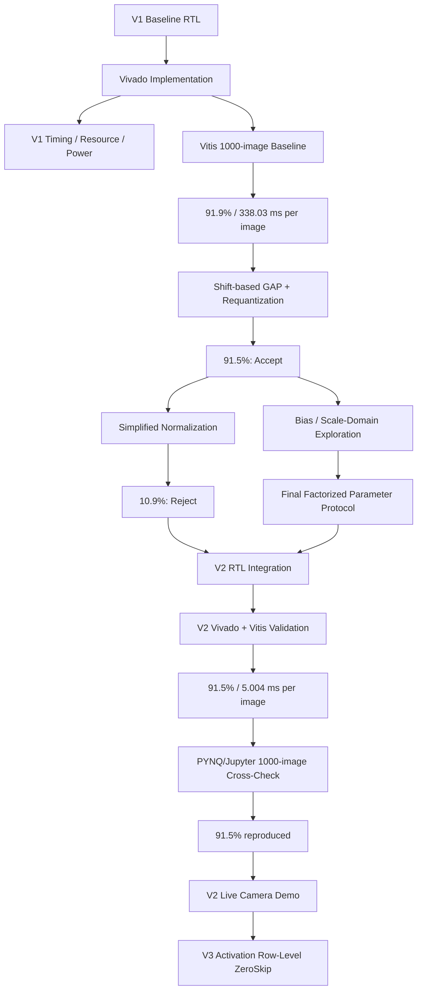
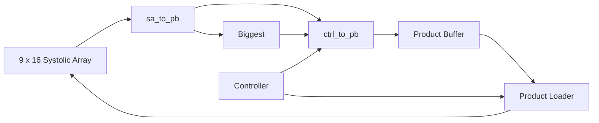

# Experimental Results

This document records the experimental validation and design-space exploration performed during Project 2.

The work is organized into four stages:

1. **V1 baseline characterization**
   - implementation and timing analysis;
   - resource and power characterization;
   - 1,000-image Vitis inference validation.

2. **V2 numerical exploration**
   - shift-based requantization and GAP;
   - input-preprocessing simplification experiment;
   - bias / scale-domain experiments.

3. **V2 RTL and system validation**
   - end-to-end PL execution;
   - timing and resource analysis;
   - 1,000-image Vitis validation;
   - communication and latency comparison against V1.

4. **V2 PYNQ/Jupyter live-camera validation**
   - PYNQ driver cross-check;
   - USB camera integration;
   - recorded live inference demonstration.

The staged workflow separates numerical correctness, RTL implementation, and application-level demonstration behavior.

---

# 1. Experimental Environment

| Item | Configuration |
|---|---|
| FPGA board | PYNQ-Z2 |
| FPGA device | XC7Z020 |
| Vivado | 2025.2.1 |
| Vitis | 2025.2 |
| Dataset | CIFAR-10 |
| Main evaluation set | 1,000 images |
| Compute array | 9 x 16 weight-stationary systolic array |
| Processing elements | 144 |
| PS-PL interface | 32-bit AXI4-Lite |
| NPU base address | `0x40000000` |
| Target clock | 125 MHz |

The same board, compute-array organization, and AXI4-Lite system integration are maintained across V1 and V2 so that the comparison focuses on the execution structure inside the custom NPU IP.

---

# 2. Experimental Workflow



The workflow answers three questions in sequence:

1. Does a proposed numerical approximation preserve model accuracy?
2. Can the accepted operation be implemented in the FPGA datapath?
3. After RTL integration, what changes in latency, communication, resources, and practical live-demo behavior?

---

# 3. V1 Baseline FPGA Implementation

V1 represents the PS-managed architecture in which the PL primarily executes tiled matrix multiplication.

The baseline provides:

- a functional reference;
- a timing reference;
- a resource reference;
- a communication reference;
- a comparison point for V2.

---

# 4. V1 Timing Analysis

The implementation target is:

```text
Clock period : 8.000 ns
Clock        : 125 MHz
```

The implemented V1 design met timing with approximately:

```text
Worst setup slack : +0.041 ns
Total delay       : 7.613 ns
Logic delay       : 2.669 ns
Net delay         : 4.944 ns
```

The critical path was dominated by controller/control-distribution routing rather than the 9 x 16 MAC datapath itself.

This observation motivated distributing some V2 post-processing logic closer to the relevant data paths instead of expanding one large centralized controller.

---

# 5. V1 Resource Utilization

| Resource | Used | Available | Utilization |
|---|---:|---:|---:|
| LUT | 3,060 | 53,200 | 5.75% |
| LUTRAM | 560 | 17,400 | 3.22% |
| FF | 6,175 | 106,400 | 5.80% |
| BRAM | 116.5 | 140 | 83.21% |
| DSP | 144 | 220 | 65.45% |

The 144 DSP blocks correspond to the 144 PEs in the 9 x 16 systolic array.

BRAM is the most constrained major resource.

V2 was therefore designed to avoid increasing the main BRAM footprint.

---

# 6. V1 Power Characterization

Vivado reported:

```text
Total on-chip power : 1.675 W
Dynamic power       : 1.523 W
Static power        : 0.152 W
```

The dynamic estimate was dominated by the Zynq Processing System.

Therefore:

```text
1.675 W
```

should not be interpreted as isolated NPU-core power.

The report confidence was Medium, so the power result is used as an implementation-level system estimate.

---

# 7. V1 Vitis Inference Result

The baseline produced:

```text
Accuracy : 919 / 1000 = 91.9%
```

Measured timing:

```text
Average end-to-end inference : 338.029 ms / image
PL MatMul execute subtotal   :   5.803 ms / image
```

The large difference between the PL MatMul subtotal and the end-to-end time shows that most V1 latency is outside the core MAC execution.

The software-measured execution time includes command issue and completion-detection overhead and therefore should not be interpreted as an exact RTL cycle count.

---

# 8. V1 Communication Cost

The dominant payload operations per image are:

```text
Activation / im2col LOAD : 637,920
Product Buffer READ      : 110,730
--------------------------------
Total                    : 748,650
```

These counts are used as an architectural communication metric.

They exclude status polling and other relatively small control operations.

---

# 9. V2 Numerical Experiment 1 — Shift-Based Requantization

The original activation requantization uses an arbitrary scale derived from the activation range.

V2 replaces this with a power-of-two approximation:

```text
q = round(x / 2^n)
```

Conceptually:

```text
ReLU output
     |
     v
find output maximum
     |
     v
select right-shift amount
     |
     v
right shift + rounding
     |
     v
saturate to INT8
```

Result:

```text
Accuracy : 915 / 1000 = 91.5%
```

Comparison:

| Configuration | Accuracy | Difference |
|---|---:|---:|
| Original reference arithmetic | 91.9% | baseline |
| Shift-based requantization | 91.5% | -0.4%p |

The 0.4 percentage-point reduction was accepted.

---

# 10. V2 Numerical Experiment 2 — Simplified Input Preprocessing

The original input preprocessing is:

```text
x = pixel / 255
x_norm = (x - mean) / std
```

A hardware-oriented experiment attempted to simplify this preprocessing by removing the standard-deviation scaling and using an integer approximation of the channel mean.

The result was:

```text
Accuracy : 109 / 1000 = 10.9%
```

This is close to random guessing for a 10-class problem.

### Decision

The simplified preprocessing was rejected.

V2 therefore retains the original CIFAR-10 channel-wise mean/std normalization on the PS.

---

# 11. V2 Bias / Scale-Domain Exploration

Bias handling is sensitive to both the activation and weight scale domains.

Early approaches that attempted to reuse an unsuitable fixed integer bias representation while changing runtime scaling did not reproduce the verified numerical behavior.

The final verified V2 interface factorizes the numerical metadata into:

```text
Parameters   0..521 : bias_over_ws_q16
Parameters 522..529 : inv_weight_scale_q16
Parameter         530: inv_input_scale_q16
```

The important lifetime distinction is:

```text
Startup / model-static
----------------------
0..521   bias_over_ws_q16
522..529 inv_weight_scale_q16

Per image
---------
530      inv_input_scale_q16
```

The 522 bias-related entries correspond to:

```text
Conv1 :  32
Conv2 :  32
Conv3 :  64
Conv4 :  64
Conv5 :  96
Conv6 :  96
FC1   : 128
FC2   :  10
----------------
Total : 522
```

This is the parameter protocol used by the verified Vitis application and the final PYNQ/Jupyter driver.

---

# 12. Final V2 Numerical Policy

The accepted V2 HW/SW partition is:

| Operation | Location |
|---|---|
| Camera / input acquisition | PS |
| Mean/std normalization | PS |
| Initial global signed INT8 quantization | PS |
| Matrix multiplication / convolution | PL |
| Bias-domain arithmetic | PL using preloaded metadata |
| ReLU | PL |
| Shift-based requantization | PL |
| 2 x 2 max pooling | PL |
| GAP | PL |
| FC1 / FC2 | PL |
| Final logits | PL -> PS |

The PL therefore executes the complete weighted network after the original input image and its initial input-scale metadata have been staged.

---

# 13. V2 Communication Analysis

## 13.1 V1

```text
Activation / im2col LOAD : 637,920
Product Buffer READ      : 110,730
--------------------------------
Total                    : 748,650 / image
```

## 13.2 V2

Model-static preload is excluded from steady-state per-image traffic.

The logical per-image data are:

```text
Input-scale parameter :    1
RGB activation         : 3072
Final logits           :   10
```

Parameter 530 is a 32-bit value transported using LOW and HIGH writes.

The actual payload-transaction count is therefore:

```text
Parameter-530 writes   :    2
RGB activation writes  : 3072
Final logit reads      :   10
--------------------------------
Total                  : 3084 / image
```

Comparison:

```text
V1 : 748,650 transactions / image
V2 :   3,084 transactions / image
```

V2 therefore reduces the dominant steady-state payload-transaction metric by approximately:

```text
99.59%
```

Status polling is excluded from this comparison.

---

# 14. V2 RTL Datapath Integration

V2 keeps the baseline 9 x 16 systolic array and adds local network-level control and post-processing.

| Module / path | Main V2 role |
|---|---|
| `Ctrl` | layer sequencing, convolution / pool / GAP control |
| `sa_to_pb` | ReLU and shift-candidate tracking |
| `Biggest` | layer-wide maximum shift selection |
| `ctrl_to_pb` | requantization, pooling, result steering |
| Product Loader / PB feedback | partial-sum and intermediate-feature reuse |

Conceptually:



Intermediate features remain in the PL rather than being returned to the PS after every weighted layer.

---

# 15. V2 Timing Result

V2 uses the same 8.0 ns clock-period target.

```text
Target period : 8.000 ns
Target clock  : 125 MHz
Worst slack   : +0.119 ns
Total delay   : 7.142 ns
Logic delay   : 0.518 ns
Net delay     : 6.624 ns
```

The top path is dominated by routing and fanout.

Thus V2 still meets the 125 MHz target despite the additional control and post-processing functionality.

---

# 16. V2 Resource Utilization

| Resource | V1 | V2 | Change |
|---|---:|---:|---:|
| LUT | 3,060 | 4,477 | +46.31% |
| LUTRAM | 560 | 1,042 | +86.07% |
| FF | 6,175 | 7,649 | +23.87% |
| BRAM | 116.5 | 116.5 | 0% |
| DSP | 144 | 144 | 0% |

V2 uses additional logic resources to internalize network-level processing.

The major compute and memory footprint remains unchanged:

```text
DSP  : 144
BRAM : 116.5
```

---

# 17. V2 Power and Estimated Energy

Vivado reported:

```text
Total on-chip power : 1.715 W
Dynamic power       : 1.562 W
Static power        : 0.153 W
```

As with V1, this is a system-level implementation estimate.

Estimated energy per image:

```text
V1 : 1.675 W x 0.33803 s ≈ 566.199 mJ / image
V2 : 1.715 W x 0.005004 s ≈   8.582 mJ / image
```

The estimated energy reduction is approximately:

```text
98.48%
```

---

# 18. V2 Full-Dataset Vitis Result

The final V2 RTL/Vitis path was evaluated over the same 1,000-image CIFAR-10 subset.

```text
Accuracy            : 915 / 1000 = 91.50%

End-to-end V2
Inference total     : 5004.700 ms
Average / image     :    5.004 ms

PS preprocessing
Preprocess total    : 1033.492 ms
Average / image     :    1.033 ms

Parameter 530 + RGB staging + PL inference + logits
Path total          : 3971.207 ms
Average / image     :    3.971 ms

Startup
Model preload       :   62.600 ms
Cold-start total    : 5067.301 ms
```

The model preload is excluded from steady-state per-image latency.

Equivalent controlled benchmark throughput:

```text
~199.84 images/s
```

The benchmark is well below the 33.3 ms/frame compute budget corresponding to 30 FPS.

---

# 19. V1 vs. V2 Summary

| Metric | V1 | V2 | Change |
|---|---:|---:|---:|
| Accuracy | 91.9% | 91.5% | -0.4%p |
| Target clock | 125 MHz | 125 MHz | same |
| Worst slack | +0.041 ns | +0.119 ns | both meet timing |
| Time / image | 338.03 ms | 5.004 ms | -98.52% |
| Speedup | 1.00x | 67.55x | — |
| Steady-state payload transactions / image | 748,650 | 3,084 | -99.59% |
| LUT | 3,060 | 4,477 | +46.31% |
| LUTRAM | 560 | 1,042 | +86.07% |
| FF | 6,175 | 7,649 | +23.87% |
| BRAM | 116.5 | 116.5 | 0% |
| DSP | 144 | 144 | 0% |
| Estimated on-chip power | 1.675 W | 1.715 W | +2.39% |
| Estimated energy / image | 566.199 mJ | 8.582 mJ | -98.48% |

The main V1-to-V2 trade-off is clear:

> V2 uses additional logic to keep network execution inside the PL, dramatically reducing repeated PS-PL traffic and software intervention.

---

# 20. PYNQ/Jupyter Functional Cross-Check

Before using live camera input, the PYNQ/Jupyter implementation was validated using the same 1,000-image test set.

Result:

```text
Accuracy : 915 / 1000 = 91.5%
```

This reproduced the Vitis accuracy exactly.

The result validates the complete PYNQ software path used by the live demo, including:

- bitstream programming;
- model weight preload;
- parameters 0..529 preload;
- per-image parameter 530;
- input preprocessing;
- R/G/B activation upload;
- end-to-end PL inference;
- final logit readback.

---

# 21. V2 Live Camera Demonstration

## 21.1 Demo Environment

| Item | Configuration |
|---|---|
| Board | PYNQ-Z2 |
| Camera | HCAM01L USB webcam |
| Runtime | PYNQ Linux / Jupyter |
| Capture API | OpenCV / V4L2 |
| Accelerator | verified V2 end-to-end NPU |
| Input to NPU | signed INT8 `3 x 32 x 32` |

Notebook:

```text
v2/v2_live_demo/V2_Final_Live_Camera_Demo_Single.ipynb
```

Recorded video:

```text
v2/v2_live_demo/Live_Demo_project2.mp4
```

---

## 21.2 Camera-to-Inference Pipeline

```text
USB webcam frame
      |
      v
center crop
      |
      v
resize to 32 x 32
      |
      v
BGR -> RGB
      |
      v
mean/std normalization
      |
      v
global INT8 input quantization
      |
      v
parameter 530 + RGB activation upload
      |
      v
V2 PL inference: Conv1 -> ... -> FC2
      |
      v
10 logits -> argmax
      |
      v
Jupyter live display
```

A background camera reader keeps the newest available frame so that capture can continue independently of the visible inference/display loop.

---

## 21.3 Observed Live-Demo Throughput

The current demonstration showed approximately:

```text
~5 FPS
```

This is an **application/display throughput** figure.

It is not the same metric as the Vitis `5.004 ms/image` result because the live path also includes:

- USB camera acquisition;
- crop / resize;
- BGR-to-RGB conversion;
- Python/Jupyter runtime behavior;
- MMIO host interaction;
- rendering;
- display updates.

The two numbers are therefore intentionally reported separately.

---

## 21.4 Recorded Demonstration

[Watch the recorded V2 live-camera demonstration](https://drive.google.com/file/d/1bns6vxbrneyFb1yLkzVsFXlarAnewryC/view?usp=drive_link)

---

# 22. Current Next Steps

V1 and V2 are implemented and evaluated, and the V2 live-camera demonstration is complete.

The remaining Project 2 work is centered on V3:

1. implement **activation row-level ZeroSkip** on top of the verified V2 engine;
2. measure activation zero-row frequency and skipped systolic-array work;
3. compare V2 and V3 under the same accuracy, timing, resource, latency, power, and energy methodology;
4. document the final V3 detection granularity and controller protocol from the implemented RTL.
