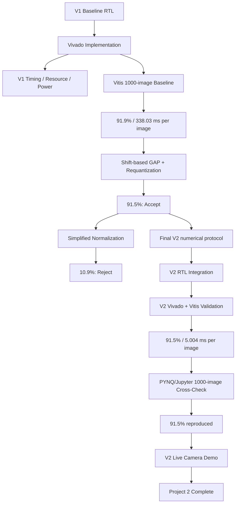

# Experimental Results

This document records the experimental validation and design-space exploration performed during Project 2.

The project progressed through four stages:

1. **V1 baseline characterization**
2. **V2 numerical exploration**
3. **V2 RTL / system validation**
4. **V2 PYNQ/Jupyter live-camera validation**

The final project scope ends at V2. A ZeroSkip extension was considered but not implemented after the live-demo results showed that practical FPS was no longer dominated by NPU MAC time.

---

# 1. Experimental Environment

| Item | Configuration |
|---|---|
| FPGA Board | PYNQ-Z2 |
| FPGA Device | XC7Z020 |
| Vivado | 2025.2.1 |
| Vitis | 2025.2 |
| Dataset | CIFAR-10 |
| Evaluation Set | 1,000 images |
| Compute Array | 9 x 16 weight-stationary systolic array |
| Processing Elements | 144 |
| PS-PL Interface | 32-bit AXI4-Lite |
| Target Clock | 125 MHz |

---

# 2. Experimental Workflow



---

# 3. V1 Timing Analysis


The baseline was implemented for an 8.0 ns clock period:

```text
Target clock : 125 MHz
Worst slack  : +0.041 ns
Total delay  : 7.613 ns
Logic delay  : 2.669 ns
Net delay    : 4.944 ns
```

The critical path was dominated by controller/control-distribution routing rather than the systolic-array MAC datapath itself.

---

# 4. V1 Power Characterization


Vivado reported:

```text
Total On-Chip Power : 1.675 W
Dynamic Power       : 1.523 W
Static Power        : 0.152 W
```

The reported power is treated as a system-level implementation estimate rather than isolated NPU-core power.

---

# 5. V1 Resource Utilization


| Resource | Used | Available | Utilization |
|---|---:|---:|---:|
| LUT | 3,060 | 53,200 | 5.75% |
| LUTRAM | 560 | 17,400 | 3.22% |
| FF | 6,175 | 106,400 | 5.80% |
| BRAM | 116.5 | 140 | 83.21% |
| DSP | 144 | 220 | 65.45% |

BRAM is the most constrained major resource. The 144 DSP blocks correspond directly to the 144 processing elements of the 9 x 16 systolic array.

---

# 6. V1 Full-Dataset Vitis Result


```text
Accuracy : 919 / 1000 = 91.9%

Average end-to-end inference : 338.029 ms / image
PL MatMul execute subtotal   :   5.803 ms / image
```

The large difference between PL MatMul time and total inference time showed that the major V1 bottleneck was outside the core MAC execution.

---

# 7. Shift-Based Requantization Experiment


The original arbitrary activation scaling was replaced by a power-of-two approximation:

```text
q = round(x / 2^n)
```

Result:

```text
Accuracy : 915 / 1000 = 91.5%
```

Comparison:

| Configuration | Accuracy | Difference |
|---|---:|---:|
| Original reference arithmetic | 91.9% | baseline |
| Shift-based requantization | 91.5% | -0.4%p |

The 0.4 percentage-point reduction was accepted.

---

# 8. Simplified Input Preprocessing Experiment


A hardware-oriented preprocessing simplification removed the standard-deviation scaling and approximated the channel mean using integer arithmetic.

Result:

```text
Accuracy : 109 / 1000 = 10.9%
```

This result was rejected. V2 therefore retains the original CIFAR-10 mean/std normalization on the PS.

---

# 9. Final V2 Parameter Protocol

The verified V2 host interface uses:

```text
Startup / model-static
----------------------
Parameters   0..521 : bias_over_ws_q16
Parameters 522..529 : inv_weight_scale_q16

Per image
---------
Parameter         530: inv_input_scale_q16
```

A complete 32-bit parameter is transferred as:

```text
LOW  = {0, ParamNumber[14:0], Value[15:0]}
HIGH = {1, ParamNumber[14:0], Value[31:16]}
```

The 522 bias-related parameters correspond to:

```text
Conv1 :  32
Conv2 :  32
Conv3 :  64
Conv4 :  64
Conv5 :  96
Conv6 :  96
FC1   : 128
FC2   :  10
----------------
Total : 522
```

These values are loaded once at startup in the final verified implementation, not once per image.

---

# 10. V2 Communication Analysis

## V1

```text
Activation / im2col LOAD : 637,920
Product Buffer READ      : 110,730
--------------------------------
Total                    : 748,650 / image
```

## V2

```text
Parameter 530 LOW/HIGH :    2 writes
RGB activation         : 3072 writes
Final logits           :   10 reads
--------------------------------
Total                  : 3084 / image
```

Model-static weights and parameters 0..529 are excluded from steady-state per-image traffic.

The dominant steady-state payload metric is reduced by approximately **99.59%**.

---

# 11. V2 Timing Result


```text
Target period : 8.000 ns
Target clock  : 125 MHz
Worst slack   : +0.119 ns
Total delay   : 7.142 ns
Logic delay   : 0.518 ns
Net delay     : 6.624 ns
```

V2 meets the same 125 MHz target used by V1.

---

# 12. V2 Resource Utilization


| Resource | V1 | V2 | Change |
|---|---:|---:|---:|
| LUT | 3,060 | 4,477 | +46.31% |
| LUTRAM | 560 | 1,042 | +86.07% |
| FF | 6,175 | 7,649 | +23.87% |
| BRAM | 116.5 | 116.5 | 0% |
| DSP | 144 | 144 | 0% |

V2 adds control and post-processing logic while keeping the main DSP and BRAM footprint unchanged.

---

# 13. V2 Power and Estimated Energy


```text
Total On-Chip Power : 1.715 W
Dynamic Power       : 1.562 W
Static Power        : 0.153 W
```

Estimated energy per image:

```text
V1 : 1.675 W x 0.33803 s ~= 566.199 mJ / image
V2 : 1.715 W x 0.005004 s ~=   8.582 mJ / image
```

The estimated energy reduction is approximately 98.48%.

---

# 14. V2 Full-Dataset Vitis Result


```text
Accuracy            : 915 / 1000 = 91.50%

End-to-end V2
Inference total     : 5004.700 ms
Average / image     :    5.004 ms

PS preprocessing
Preprocess total    : 1033.492 ms
Average / image     :    1.033 ms

Parameter 530 + RGB staging + PL inference + logits
Path total          : 3971.207 ms
Average / image     :    3.971 ms

Startup
Model preload       :   62.600 ms
Cold-start total    : 5067.301 ms
```

Equivalent controlled benchmark throughput is approximately `199.84 images/s`.

---

# 15. V1 vs. V2 Summary

| Metric | V1 | V2 | Change |
|---|---:|---:|---:|
| Accuracy | 91.9% | 91.5% | -0.4%p |
| Target clock | 125 MHz | 125 MHz | same |
| Worst slack | +0.041 ns | +0.119 ns | both meet timing |
| Time / image | 338.03 ms | 5.004 ms | -98.52% |
| Speedup | 1.00x | 67.55x | — |
| Steady-state payload transactions / image | 748,650 | 3,084 | -99.59% |
| LUT | 3,060 | 4,477 | +46.31% |
| LUTRAM | 560 | 1,042 | +86.07% |
| FF | 6,175 | 7,649 | +23.87% |
| BRAM | 116.5 | 116.5 | 0% |
| DSP | 144 | 144 | 0% |
| Estimated on-chip power | 1.675 W | 1.715 W | +2.39% |
| Estimated energy / image | 566.199 mJ | 8.582 mJ | -98.48% |

---

# 16. PYNQ/Jupyter Functional Cross-Check

Before using live camera input, the PYNQ/Jupyter implementation was validated using the same 1,000-image test set.

```text
Accuracy : 915 / 1000 = 91.5%
```

This reproduced the Vitis result exactly and validated the complete host path: bitstream programming, model preload, parameter handling, preprocessing, RGB upload, PL inference, and logit readback.

---

# 17. V2 Live Camera Demonstration

## Demo Environment

| Item | Configuration |
|---|---|
| Board | PYNQ-Z2 |
| Camera | HCAM01L USB webcam |
| Runtime | PYNQ Linux / Jupyter |
| Capture API | OpenCV / V4L2 |
| Accelerator | verified V2 end-to-end NPU |
| Input to NPU | signed INT8 `3 x 32 x 32` |

Notebook:

```text
v2/v2_live_demo/V2_Final_Live_Camera_Demo_Single.ipynb
```

Recorded demo:

```text
v2/v2_live_demo/Live_Demo_project2.mp4
```

Pipeline:

```text
USB webcam frame
      |
      v
center crop -> resize -> BGR/RGB conversion
      |
      v
mean/std normalization
      |
      v
global INT8 input quantization
      |
      v
parameter 530 + RGB activation upload
      |
      v
V2 PL inference: Conv1 -> ... -> FC2
      |
      v
10 logits -> argmax
      |
      v
Jupyter live display
```

Observed application/display throughput:

```text
~5 FPS
```

This value includes camera acquisition, preprocessing, Python/Jupyter execution, MMIO interaction, rendering, and display updates.

---

# 18. Scope Decision and Project Conclusion

An activation row-level ZeroSkip extension was initially considered as a possible next stage.

However, the final live demo showed:

```text
Controlled V2 benchmark : 5.004 ms / image
Live PYNQ/Jupyter demo   : ~5 FPS (~200 ms / displayed frame)
```

These measurements have different scopes and should not be directly converted into an RTL speedup estimate. However, they clearly show that the current practical live-demo FPS is not dominated by several milliseconds of NPU MAC execution.

Therefore, reducing the NPU MAC time further with ZeroSkip would not be expected to materially improve the current application-level frame rate.

For this reason, Project 2 is concluded at V2.

Further performance work should profile and optimize the host/runtime/display path rather than focusing only on additional MAC-cycle reduction.

---

# 19. Final Project Status

```text
V1 Baseline
  [DONE]
  91.9%
  338.03 ms/image
        |
        v
V2 End-to-End PL
  [DONE]
  91.5%
  5.004 ms/image
  125 MHz timing met
        |
        v
V2 PYNQ/Jupyter Live Camera Demo
  [DONE]
  ~5 FPS application/display throughput
        |
        v
PROJECT 2 COMPLETE
```
