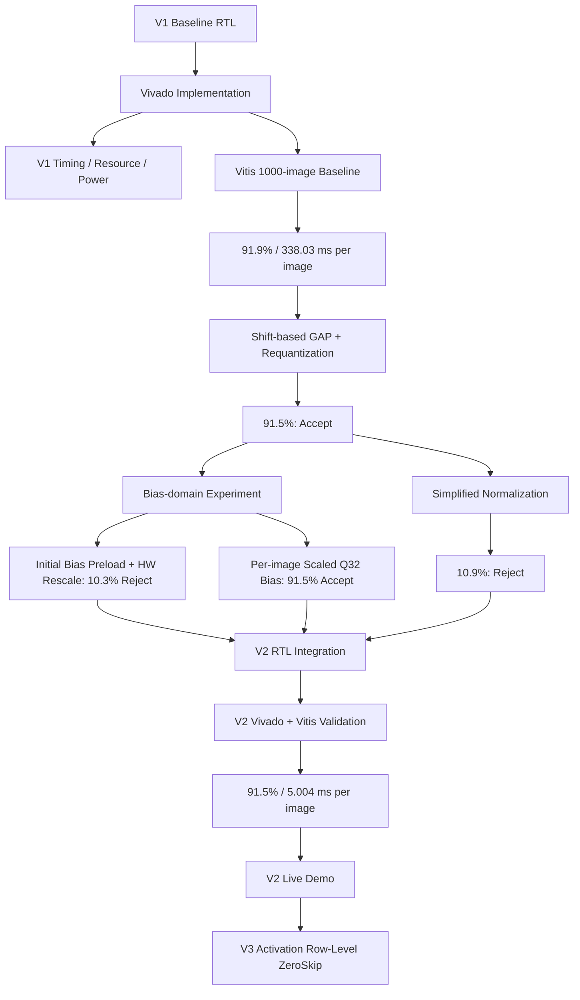
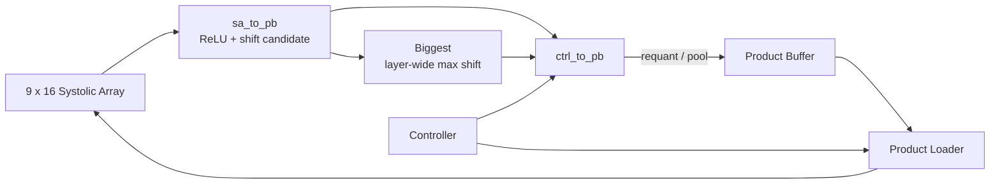

# Experimental Results

This document records the experimental validation and design-space
exploration performed during the development of Project 2.

The experiments are divided into three stages:

1. **V1 baseline characterization**
   - FPGA implementation and timing analysis
   - resource and power characterization
   - full-dataset inference validation using Vitis

2. **V2 numerical design exploration**
   - hardware-friendly requantization and GAP
   - hardware-friendly input preprocessing
   - bias-domain handling
   - accuracy evaluation before RTL integration

3. **V2 RTL and system validation**
   - end-to-end PL inference
   - timing and resource analysis
   - full-dataset Vitis validation
   - PS–PL communication reduction
   - latency and estimated energy comparison against V1

The numerical exploration was performed first so that arithmetic changes
could be rejected or accepted before the corresponding V2 RTL was finalized.
The accepted configuration was then implemented and evaluated as the V2 engine.

---

# 1. Experimental Environment

All experiments use the same PYNQ-Z2 system-level platform, toolchain,
AXI4-Lite interface, and 9 × 16 compute-array organization. V1 and V2 differ
in the execution structure implemented inside the custom NPU IP.

| Item | Configuration |
|---|---|
| FPGA Board | PYNQ-Z2 |
| FPGA Device | XC7Z020 |
| Vivado | 2025.2.1 |
| Vitis | 2025.2 |
| Dataset | CIFAR-10 |
| Evaluation Set | 1,000 images |
| Compute Array | 9 × 16 weight-stationary systolic array |
| Processing Elements | 144 |
| PS–PL Interface | 32-bit AXI4-Lite |

The same Vivado Block Design and PS–PL interface are maintained
throughout the project.

This allows later V1/V2/V3 comparisons to focus on changes inside the
NPU engine rather than changes to the surrounding FPGA platform.

---

# 2. Experimental Workflow

V1 was first implemented and measured as the reference engine. Candidate
V2 arithmetic changes were then evaluated in the Vitis inference model before
being committed to RTL. Finally, the accepted arithmetic and end-to-end PL
execution structure were implemented as V2 and measured on the same board.



This sequence separates three questions:

1. does the numerical approximation preserve accuracy?
2. can the accepted operation be mapped to a hardware-friendly datapath?
3. after RTL integration, how much end-to-end latency and communication are actually reduced?

---

# 3. V1 Baseline FPGA Implementation

The V1 baseline was successfully implemented on the PYNQ-Z2.

The baseline represents the original PS-managed execution model in
which the PL primarily operates as a matrix-multiplication
accelerator.

The implementation serves two purposes:

- provide a functional reference for V2 development,
- establish timing, resource, and inference-accuracy baselines.

---

## 3.1 Timing Analysis


The design was implemented with a target clock period of:

```text
8.0 ns
```

corresponding to:

```text
125 MHz
```

The worst reported setup paths retain only a small positive timing
margin.

The top critical paths show:

```text
Slack       : 0.041 ns
Total Delay : 7.613 ns
Requirement : 8.000 ns
```

The reported paths originate from controller logic such as:

```text
u_Ctrl/cnt_OC_reg[4]
```

and terminate at control/register-enable paths associated with the
address-generation logic.

This indicates that the **controller/control-distribution network is
the primary timing bottleneck of the current baseline**, rather than
the 9 × 16 systolic-array datapath itself.

The critical paths also contain relatively large routing delay:

```text
Logic Delay : 2.669 ns
Net Delay   : 4.944 ns
```

Therefore, approximately two thirds of the critical-path delay is
associated with routing rather than combinational logic.

This suggests that future controller expansion should be performed
carefully. V2 introduces additional layer scheduling, tiling,
requantization, pooling, and feedback control inside the PL, and
placing all of this functionality in a single centralized controller
could further degrade timing.

The V2 architecture therefore attempts to distribute local operations
such as ReLU, requantization, and pooling closer to their respective
datapaths instead of placing all processing logic inside the main
controller.

> **Baseline timing result:** the implemented V1 design meets the
> 125 MHz timing target, but with limited setup margin.

---

# 4. Baseline Power Characterization


Vivado reports a total on-chip power estimate of:

```text
Total On-Chip Power : 1.675 W
Dynamic Power       : 1.523 W
Static Power        : 0.152 W
```

The dynamic-power breakdown is dominated by the Zynq Processing
System:

| Component | Power |
|---|---:|
| PS7 | 1.256 W |
| DSP | 0.159 W |
| Clocks | 0.057 W |
| Signals | 0.032 W |
| BRAM | 0.012 W |
| Logic | 0.007 W |

The PS7 accounts for approximately **82% of the reported dynamic
power**.

Therefore, the reported 1.675 W should **not** be interpreted as the
power consumption of the NPU accelerator alone.

In addition, Vivado reports a **Medium** confidence level for this
power estimate. The result is based on implementation-level activity
assumptions rather than a dedicated measured NPU workload trace.

For this reason, the current power report is treated primarily as
**baseline platform characterization**.

Future V1/V2/V3 power comparisons should use identical activity
assumptions or workload-derived switching activity before drawing
conclusions about the energy benefit of architectural modifications.

---

# 5. Baseline Resource Utilization


The implemented baseline uses:

| Resource | Used | Available | Utilization |
|---|---:|---:|---:|
| LUT | 3,060 | 53,200 | 5.75% |
| LUTRAM | 560 | 17,400 | 3.22% |
| FF | 6,175 | 106,400 | 5.80% |
| BRAM | 116.5 | 140 | 83.21% |
| DSP | 144 | 220 | 65.45% |

The design is primarily constrained by **BRAM utilization**.

Approximately 83% of the available BRAM resources are already used by
the baseline platform.

The 144 DSP blocks correspond directly to the 144 processing elements
of the 9 × 16 systolic array.

The resource configuration of the baseline compute platform is
intended to remain fixed across the main V1/V2/V3 comparison.
Therefore, the absolute baseline utilization is recorded here mainly
to document the FPGA implementation and identify resource constraints.

In particular, the high BRAM utilization motivates avoiding
unnecessary increases in on-chip buffer capacity during V2
development.

For example, the V2 Activation Buffer remains 1024 deep and larger
logical inputs are handled through tiling rather than increasing the
buffer depth solely to accommodate the complete RGB input at once.

---

# 6. Vitis Inference Evaluation

The implemented Vivado design was exported to Vitis and evaluated
using the inference application contained in:

```text
vitis/application/
```

The same hardware platform and evaluation workflow were used for all
three numerical experiments below.

Only the inference-model arithmetic was modified between experiments.

This provides a lightweight method for evaluating potential V2
changes before implementing the corresponding hardware logic.

---

# 7. Experiment 1 — V1 Baseline Inference


The original V1 inference model was first evaluated without modifying
the preprocessing or requantization scheme.

## 7.1 Original Input Preprocessing

The baseline preprocessing performs channel-wise normalization:

$x_{norm,c} = \frac{x_c-\mu_c}{\sigma_c}$

where:

- $x_c$ is the input pixel value of channel $c$,
- $\mu_c$ is the channel mean,
- $\sigma_c$ is the channel standard deviation.

Thus, both mean subtraction and standard-deviation scaling are
performed before the input activation is passed to the NPU inference
pipeline.

---

## 7.2 Original Requantization

The original activation quantization determines a scale from the
activation range.

Conceptually:

$s = \frac{2\cdot \max(|x|)}{255}$

and the quantized activation is obtained from:

`q ≈ x / s`

with the result represented in the target signed 8-bit domain.

Unlike a power-of-two scaling scheme, the scale $s$ can take an
arbitrary value.

This provides fine-grained use of the INT8 range, but direct hardware
implementation would require more complex scaling arithmetic than a
simple shift operation.

---

## 7.3 Baseline Accuracy

The baseline produced:

```text
Accuracy : 919 / 1000
         : 91.9%
```

This result is used as the reference accuracy for the V2 numerical
experiments.

The measured execution statistics were:

```text
Average inference time : 338.029 ms / image
PL execute time        :   5.803 ms / image
MatMul execute calls   : 73,000
```

The large difference between PL execution time and total inference
time illustrates the software and PS-side overhead present in the V1
execution model.

However, the reported `Execute → DONE` time is measured using the PS
Global Timer and includes command-issue and DONE-detection overhead.

It should therefore **not** be interpreted as an exact RTL-only cycle
measurement.

An RTL-internal cycle counter is required for exact PL execution-cycle
measurement.

---

# 8. Experiment 2 — Shift-Based Requantization

The first V2-oriented modification replaces the original arbitrary
requantization scale with a hardware-friendly power-of-two scale.

The input preprocessing remains unchanged.

```text
Original preprocessing
        +
Shift-based requantization
```


---

## 8.1 Motivation

The original requantization uses a scale derived from the exact
activation range.

Although numerically efficient, arbitrary scaling is less attractive
for a simple FPGA datapath.

V2 instead approximates the required scaling factor using a
power-of-two value:

$2^n$

so that requantization can be implemented primarily using a right
shift.

Conceptually:

```text
ReLU output
     ↓
Find maximum activation
     ↓
Determine required shift
     ↓
Right shift
     ↓
Rounding
     ↓
INT8 activation
```

The shift amount is selected so that the activation values can be
represented within the target 8-bit range.

Instead of:

`q ≈ x / s`

using an arbitrary $s$, V2 uses:

`q = round(x / 2^n)`

which can be implemented as:

```text
shift + rounding
```

rather than a general scaling operation.

---

## 8.2 Rounding

The modified requantization does not simply truncate the discarded
bits.

The highest discarded bit is used to determine whether the shifted
result should be incremented.

Conceptually:

```text
shifted = x >> n

if highest_discarded_bit == 1:
    shifted = shifted + 1
```

This approximates rounding while retaining a hardware-friendly
implementation.

---

## 8.3 Result

The modified requantization produced:

```text
Accuracy : 915 / 1000
         : 91.5%
```

Compared with the baseline:

| Configuration | Correct | Accuracy | Difference |
|---|---:|---:|---:|
| Original requantization | 919 / 1000 | 91.9% | Baseline |
| Shift-based requantization | 915 / 1000 | 91.5% | -0.4%p |

Only four additional images were misclassified in the 1,000-image
evaluation.

The measured timing remained essentially unchanged:

```text
PL execute average : 5.803 ms / image
MatMul calls       : 73,000
```

This is expected because the requantization modification is currently
implemented in the **Vitis inference model**, not yet as new V2 RTL.

Therefore, this experiment evaluates **numerical suitability**, not
the hardware-performance benefit of the new requantization unit.

### Decision

The accuracy reduction of only **0.4 percentage points** was
considered acceptable.

The shift-based requantization scheme is therefore **adopted for V2
RTL implementation**.

---

# 9. Experiment 3 — Simplified Input Preprocessing

The second V2-oriented experiment investigates whether the input
preprocessing stage can also be simplified for hardware
implementation.

The shift-based requantization from Experiment 2 is retained.

```text
Simplified preprocessing
        +
Shift-based requantization
```


---

## 9.1 Original Preprocessing

The original preprocessing performs:

$x_{norm,c} = \frac{x_c-\mu_c}{\sigma_c}$

for each RGB channel.

The division by the channel standard deviation introduces scaling that
would require additional arithmetic if the complete preprocessing
stage were moved directly into the PL.

---

## 9.2 Hardware-Oriented Modification

A simplified preprocessing scheme was therefore evaluated.

The channel mean was approximated using the 1024 pixels of each
32 × 32 input channel:

`mu_int = round(sum(x[0:1024]) / 1024)`

Since:

$1024 = 2^{10}$

the division can be implemented using a right shift.

The evaluated integer approximation was conceptually:

`mu_int = (sum >> 10) + rounding_bit`

followed by:

`x' = clip(x - mu_int, -128, 127)`

The standard-deviation division was removed.

Therefore, the preprocessing changed from:

`x_norm,c = (x_c - mu_c) / sigma_c`

to approximately:

`x'_c = clip(x_c - mu_int,c)`

This eliminates the standard-deviation scaling and replaces the mean
calculation with shift-based integer arithmetic.

---

## 9.3 Result

The modified preprocessing produced:

```text
Accuracy : 109 / 1000
         : 10.9%
```

The complete numerical comparison is:

| Configuration | Accuracy | Δ vs. Baseline |
|---|---:|---:|
| Original preprocessing + original requantization | 91.9% | — |
| Original preprocessing + shift-based requantization | 91.5% | -0.4%p |
| Simplified preprocessing + shift-based requantization | 10.9% | -81.0%p |

The accuracy falls close to the 10% random-guess level of a
10-class classification problem.

This demonstrates that the standard-deviation normalization is
essential to the behavior of the current trained model.

Unlike the requantization approximation, removing this scaling
substantially changes the distribution of the input presented to the
network.

### Decision

The simplified preprocessing scheme is **rejected**.

V2 therefore retains the original input normalization on the PS.

---

# 10. V2 HW/SW Partition Decision

The Vitis exploration leads to two different conclusions.

```text
                   Candidate Modification
                            │
             ┌──────────────┴──────────────┐
             │                             │
      Requantization                 Preprocessing
             │                             │
     Shift + rounding            Remove std. division
             │                             │
          91.5%                         10.9%
             │                             │
          ACCEPT                         REJECT
             │                             │
             ▼                             ▼
          Move to PL                  Keep on PS
```

The resulting V2 partition is:

| Operation | V2 Location |
|---|---|
| Input preprocessing / normalization | PS |
| Matrix multiplication / convolution | PL |
| Bias addition | PL |
| ReLU | PL |
| Shift-based requantization | PL |
| Max pooling | PL |
| GAP | PL |
| Fully connected layers | PL |
| Final classification result | PL → PS |

Thus, V2 does **not** attempt to move every mathematical operation into
hardware indiscriminately.

Instead, software exploration is used to determine which
hardware-oriented approximations preserve model behavior before they
are integrated into the RTL architecture.

---

# 11. Numerical-Exploration Decision

The software-side exploration established the arithmetic configuration that was
carried into V2 RTL.

| Candidate | Accuracy | Decision |
|---|---:|---|
| V1 reference arithmetic | 91.9% | Baseline |
| Original normalization + shift-based GAP/requantization | 91.5% | Accept |
| Simplified normalization + shift-based GAP/requantization | 10.9% | Reject |
| Initial INT32 bias preload + runtime hardware rescaling | 10.3% | Reject |
| Per-image activation-scale-dependent Q32 bias load | 91.5% | Accept |

The resulting V2 numerical policy is therefore:

```text
PS: original CIFAR-10 normalization and input quantization
                 │
                 ▼
PL: INT8 weighted layers
    + scaled bias
    + ReLU
    + shift-based requantization
    + maxpool / GAP
    + FC layers
```

---

# 12. V2 Bias-Domain Experiment

Bias handling became a separate design issue because the integer bias presented
to an accumulator depends on the activation scale as well as the fixed weight
scale.

Conceptually, for activation scale `s_x` and weight scale `s_w`:

```text
bias_acc = round(bias_real / (s_x * s_w))
```

The activation scale changes with each input image and continues to evolve after
layer requantization. Two approaches were therefore evaluated.

## 12.1 Initial Bias Preload + Runtime Hardware Rescaling

The first attempt preloaded one INT32 bias representation and attempted to
rescale it in hardware as activation scale information changed.

```text
Accuracy : 103 / 1000
         : 10.3%
```

This result was rejected because it did not reproduce the verified reference
numerics.

## 12.2 Per-Image Scaled Q32 Bias Load

The accepted approach prepares the bias values in the PS using the current
activation scale and sends the resulting Q32 values before inference.

The eight weighted layers contain a total of:

```text
Conv1 :  32
Conv2 :  32
Conv3 :  64
Conv4 :  64
Conv5 :  96
Conv6 :  96
FC1   : 128
FC2   :  10
----------------
Total : 522 biases
```

This adds **522 parameter payload transfers per image**, but restores the
expected V2 accuracy:

```text
Accuracy : 915 / 1000
         : 91.5%
```

The 522-transfer overhead is small compared with the baseline's repeated
intermediate activation upload and Product Buffer readback.

---

# 13. PS–PL Communication Analysis

The dominant software-visible data payload count was measured from the inference
flow. This count is used as an architectural communication metric; it is not a
count of every low-level AXI channel handshake signal.

## 13.1 V1 Baseline

The PS performs im2col and repeatedly loads matrix-multiplication inputs, then
reads products back from the PL.

```text
Activation / im2col LOAD payloads : 637,920 / image
Product READ payloads             : 110,730 / image
--------------------------------------------------
Total                              : 748,650 / image
```

## 13.2 V2 End-to-End Engine

After the one-time model preload, the dominant per-image payloads are:

```text
Scaled bias parameters :   522
RGB activation         : 3,072
Final logits           :    10
------------------------------
Total                  : 3,604 / image
```

Therefore:

```text
V2 / V1 payload count = 3,604 / 748,650
                      ≈ 0.004814
```

or a reduction of approximately **99.52%** in this payload-count metric.

This communication reduction is the central architectural reason for V2. The
matrix-multiplication datapath remains similar, but intermediate feature maps no
longer return to the PS after every layer.

---

# 14. V2 RTL Datapath Integration

V2 extends the baseline MatMul engine with local post-processing and
network-level control while preserving the 9 × 16 systolic array.

The main added responsibilities are:

| Module / Path | V2 Function |
|---|---|
| `Ctrl` | layer sequencing, convolution/GAP/maxpool control, bias-related control |
| `sa_to_pb` | ReLU and candidate requantization-shift tracking |
| `Biggest` | reduction of shift candidates to the layer-wide maximum shift |
| `ctrl_to_pb` | shift-based requantization, maxpool, bias transport toward Product Loader |
| Product Loader / PB feedback | partial-sum and intermediate-feature reuse inside PL |



The maximum shift is retained across all output-channel tiles belonging to the
same layer. Requantization therefore uses one layer/tensor-wide shift rather
than an independent scale for each output channel.

---

# 15. V2 Timing Result


V2 was implemented with the same 8.0 ns clock-period target used for V1.

```text
Target period : 8.000 ns
Target clock  : 125 MHz
Top slack     : +0.119 ns
Total delay   : 7.142 ns
Logic delay   : 0.518 ns
Net delay     : 6.624 ns
High fanout   : 64
```

Thus, V2 also meets the **125 MHz** target.

The critical-path character changes compared with V1. The V1 top path was
associated with central controller/address-enable distribution. In V2, the top
reported setup path is dominated by a high-fanout routed connection from a
pipeline register toward BRAM data input.

Approximately:

```text
6.624 / 7.142 ≈ 92.7%
```

of the top-path delay is routing delay. This means the final V2 timing limit is
primarily a placement/routing and fanout problem rather than a deep
combinational-logic problem.

---

# 16. V2 Resource Utilization


| Resource | V1 | V2 | Change |
|---|---:|---:|---:|
| LUT | 3,060 | 4,477 | +46.31% |
| LUTRAM | 560 | 1,042 | +86.07% |
| FF | 6,175 | 7,649 | +23.87% |
| BRAM | 116.5 | 116.5 | 0% |
| DSP | 144 | 144 | 0% |

V2 adds control, post-processing, and intermediate-data-management logic, so the
LUT/LUTRAM/FF cost increases. In contrast, the main compute array remains fixed:
144 DSPs are still used by the 144 PEs, and BRAM usage remains 116.5 blocks.

The unchanged BRAM result is important because V1 already consumes 83.21% of
the available BRAM. V2 therefore achieves end-to-end PL execution without
expanding the major on-chip memory footprint.

---

# 17. V2 Power and Estimated Energy per Image


Vivado reports:

```text
Total On-Chip Power : 1.715 W
Dynamic Power       : 1.562 W
Static Power        : 0.153 W
```

The dynamic breakdown remains dominated by PS7:

| Component | V2 Power |
|---|---:|
| PS7 | 1.256 W |
| DSP | 0.165 W |
| Clocks | 0.051 W |
| Signals | 0.058 W |
| Logic | 0.019 W |
| BRAM | 0.013 W |

As with V1, this is a **system-level Vivado estimate**, not an isolated NPU
power measurement. The report confidence remains Medium.

The estimated energy per image is obtained by multiplying the reported total
on-chip power by measured end-to-end inference time:

```text
V1 : 1.675 W × 0.33803 s ≈ 566.199 mJ / image
V2 : 1.715 W × 0.005004 s ≈   8.582 mJ / image
```

Although the total estimated on-chip power rises slightly, the much shorter
execution time reduces estimated energy per image by approximately **98.48%**.

---

# 18. V2 Full-Dataset Vitis Result


The completed V2 RTL/Vitis flow was evaluated over the same 1,000-image
CIFAR-10 subset.

```text
Accuracy            : 915 / 1000 = 91.50%

End-to-end V2
Inference total     : 5004.700 ms
Average / image     :    5.004 ms

PS preprocessing
Preprocess total    : 1033.492 ms
Average / image     :    1.033 ms

Parameter/input staging + PL inference + logits
Path total          : 3971.207 ms
Average / image     :    3.971 ms

Startup
Model preload       :   62.600 ms
Cold-start total    : 5067.301 ms
```

The one-time model preload is excluded from the steady-state per-image inference
number and is reported separately as cold-start overhead.

At 5.004 ms per image, the measured benchmark throughput is approximately:

```text
1000 / 5.004 ≈ 199.84 images/s
```

This is well above the **30 FPS compute-latency target**. A complete live-camera
FPS figure still depends on camera capture, resize/crop, display, and other demo
overheads and should therefore be measured separately.

---

# 19. V1 vs. V2 Summary

| Metric | V1 Baseline | V2 End-to-End | Change |
|---|---:|---:|---:|
| Accuracy | 91.9% | 91.5% | -0.4 percentage points |
| Target clock | 125 MHz | 125 MHz | same |
| Worst reported slack | +0.041 ns | +0.119 ns | both meet timing |
| Time / image | 338.03 ms | 5.004 ms | -98.52% |
| Speedup | 1.00× | **67.55×** | — |
| Payload transfers / image | 748,650 | 3,604 | -99.52% |
| LUT | 3,060 | 4,477 | +46.31% |
| LUTRAM | 560 | 1,042 | +86.07% |
| FF | 6,175 | 7,649 | +23.87% |
| BRAM | 116.5 | 116.5 | 0% |
| DSP | 144 | 144 | 0% |
| Estimated on-chip power | 1.675 W | 1.715 W | +2.39% |
| Estimated energy / image | 566.199 mJ | 8.582 mJ | -98.48% |

The key V1→V2 trade-off is therefore clear: V2 spends additional logic resources
to keep layer scheduling and intermediate processing inside the PL, while
substantially reducing PS–PL communication and end-to-end latency.

---

# 20. Current Next Steps

The V2 architecture is now implemented and validated. The remaining Project 2
steps are:

1. integrate the V2 Vitis application into the live-demo environment and record a demo video;
2. measure complete camera-to-result FPS separately from the 1,000-image benchmark;
3. implement **V3 activation row-level ZeroSkip** on top of the V2 architecture;
4. compare V2 and V3 under the same timing, resource, accuracy, latency, power, and energy methodology.

The exact V3 row-skipping schedule and detection granularity should be documented
after the RTL interface is finalized rather than inferred from the earlier
column-level draft.
