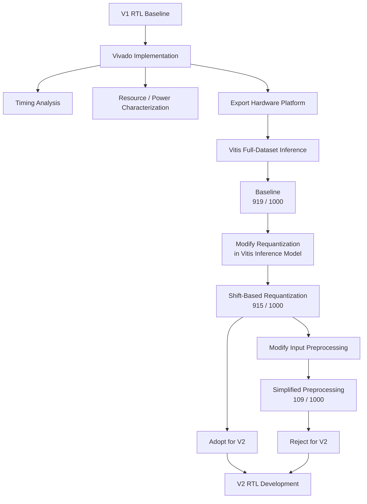

# Experimental Results

This document records the experimental validation and design-space
exploration performed during the development of Project 2.

The experiments are divided into two stages:

1. **V1 baseline characterization**
   - FPGA implementation and timing analysis
   - resource and power characterization
   - full-dataset inference validation using Vitis

2. **V2 numerical design exploration**
   - hardware-friendly requantization
   - hardware-friendly input preprocessing
   - accuracy evaluation before RTL integration

The purpose of the second stage is to evaluate numerical modifications
in software before committing them to the V2 RTL architecture.

---

# 1. Experimental Environment

All experiments use the same PYNQ-Z2 platform and baseline NPU
architecture.

| Item | Configuration |
|---|---|
| FPGA Board | PYNQ-Z2 |
| FPGA Device | XC7Z020 |
| Vivado | 2025.2.1 |
| Vitis | 2025.2 |
| Dataset | CIFAR-10 |
| Evaluation Set | 1,000 images |
| Compute Array | 9 × 16 weight-stationary systolic array |
| Processing Elements | 144 |
| PS–PL Interface | 32-bit AXI4-Lite |

The same Vivado Block Design and PS–PL interface are maintained
throughout the project.

This allows later V1/V2/V3 comparisons to focus on changes inside the
NPU engine rather than changes to the surrounding FPGA platform.

---

# 2. Experimental Workflow

V1 was first implemented and validated as the reference platform.

Before implementing the complete V2 architecture in RTL, candidate
numerical modifications were evaluated using the existing V1
hardware and the Vitis inference application.

The experimental workflow is therefore:



This workflow separates **numerical validation** from **RTL
implementation**.

A modification is first evaluated using the same FPGA accelerator and
dataset. Only modifications that maintain acceptable model accuracy
are selected for implementation in V2.

---

# 3. V1 Baseline FPGA Implementation

The V1 baseline was successfully implemented on the PYNQ-Z2.

The baseline represents the original PS-managed execution model in
which the PL primarily operates as a matrix-multiplication
accelerator.

The implementation serves two purposes:

- provide a functional reference for V2 development,
- establish timing, resource, and inference-accuracy baselines.

---

## 3.1 Timing Analysis


The design was implemented with a target clock period of:

```text
8.0 ns
```

corresponding to:

```text
125 MHz
```

The worst reported setup paths retain only a small positive timing
margin.

The top critical paths show:

```text
Slack       : 0.041 ns
Total Delay : 7.613 ns
Requirement : 8.000 ns
```

The reported paths originate from controller logic such as:

```text
u_Ctrl/cnt_OC_reg[4]
```

and terminate at control/register-enable paths associated with the
address-generation logic.

This indicates that the **controller/control-distribution network is
the primary timing bottleneck of the current baseline**, rather than
the 9 × 16 systolic-array datapath itself.

The critical paths also contain relatively large routing delay:

```text
Logic Delay : 2.669 ns
Net Delay   : 4.944 ns
```

Therefore, approximately two thirds of the critical-path delay is
associated with routing rather than combinational logic.

This suggests that future controller expansion should be performed
carefully. V2 introduces additional layer scheduling, tiling,
requantization, pooling, and feedback control inside the PL, and
placing all of this functionality in a single centralized controller
could further degrade timing.

The V2 architecture therefore attempts to distribute local operations
such as ReLU, requantization, and pooling closer to their respective
datapaths instead of placing all processing logic inside the main
controller.

> **Baseline timing result:** the implemented V1 design meets the
> 125 MHz timing target, but with limited setup margin.

---

# 4. Baseline Power Characterization


Vivado reports a total on-chip power estimate of:

```text
Total On-Chip Power : 1.675 W
Dynamic Power       : 1.523 W
Static Power        : 0.152 W
```

The dynamic-power breakdown is dominated by the Zynq Processing
System:

| Component | Power |
|---|---:|
| PS7 | 1.256 W |
| DSP | 0.159 W |
| Clocks | 0.057 W |
| Signals | 0.032 W |
| BRAM | 0.012 W |
| Logic | 0.007 W |

The PS7 accounts for approximately **82% of the reported dynamic
power**.

Therefore, the reported 1.675 W should **not** be interpreted as the
power consumption of the NPU accelerator alone.

In addition, Vivado reports a **Medium** confidence level for this
power estimate. The result is based on implementation-level activity
assumptions rather than a dedicated measured NPU workload trace.

For this reason, the current power report is treated primarily as
**baseline platform characterization**.

Future V1/V2/V3 power comparisons should use identical activity
assumptions or workload-derived switching activity before drawing
conclusions about the energy benefit of architectural modifications.

---

# 5. Baseline Resource Utilization


The implemented baseline uses:

| Resource | Used | Available | Utilization |
|---|---:|---:|---:|
| LUT | 3,060 | 53,200 | 5.75% |
| LUTRAM | 560 | 17,400 | 3.22% |
| FF | 6,175 | 106,400 | 5.80% |
| BRAM | 116.5 | 140 | 83.21% |
| DSP | 144 | 220 | 65.45% |

The design is primarily constrained by **BRAM utilization**.

Approximately 83% of the available BRAM resources are already used by
the baseline platform.

The 144 DSP blocks correspond directly to the 144 processing elements
of the 9 × 16 systolic array.

The resource configuration of the baseline compute platform is
intended to remain fixed across the main V1/V2/V3 comparison.
Therefore, the absolute baseline utilization is recorded here mainly
to document the FPGA implementation and identify resource constraints.

In particular, the high BRAM utilization motivates avoiding
unnecessary increases in on-chip buffer capacity during V2
development.

For example, the V2 Activation Buffer remains 1024 deep and larger
logical inputs are handled through tiling rather than increasing the
buffer depth solely to accommodate the complete RGB input at once.

---

# 6. Vitis Inference Evaluation

The implemented Vivado design was exported to Vitis and evaluated
using the inference application contained in:

```text
vitis/application/
```

The same hardware platform and evaluation workflow were used for all
three numerical experiments below.

Only the inference-model arithmetic was modified between experiments.

This provides a lightweight method for evaluating potential V2
changes before implementing the corresponding hardware logic.

---

# 7. Experiment 1 — V1 Baseline Inference


The original V1 inference model was first evaluated without modifying
the preprocessing or requantization scheme.

## 7.1 Original Input Preprocessing

The baseline preprocessing performs channel-wise normalization:

$x_{norm,c} = \frac{x_c-\mu_c}{\sigma_c}$

where:

- $x_c$ is the input pixel value of channel $c$,
- $\mu_c$ is the channel mean,
- $\sigma_c$ is the channel standard deviation.

Thus, both mean subtraction and standard-deviation scaling are
performed before the input activation is passed to the NPU inference
pipeline.

---

## 7.2 Original Requantization

The original activation quantization determines a scale from the
activation range.

Conceptually:

$s = \frac{2\cdot \max(|x|)}{255}$

and the quantized activation is obtained from:

$q \approx \frac{x}{s}$

with the result represented in the target signed 8-bit domain.

Unlike a power-of-two scaling scheme, the scale $s$ can take an
arbitrary value.

This provides fine-grained use of the INT8 range, but direct hardware
implementation would require more complex scaling arithmetic than a
simple shift operation.

---

## 7.3 Baseline Accuracy

The baseline produced:

```text
Accuracy : 919 / 1000
         : 91.9%
```

This result is used as the reference accuracy for the V2 numerical
experiments.

The measured execution statistics were:

```text
Average inference time : 338.029 ms / image
PL execute time        :   5.803 ms / image
MatMul execute calls   : 73,000
```

The large difference between PL execution time and total inference
time illustrates the software and PS-side overhead present in the V1
execution model.

However, the reported `Execute → DONE` time is measured using the PS
Global Timer and includes command-issue and DONE-detection overhead.

It should therefore **not** be interpreted as an exact RTL-only cycle
measurement.

An RTL-internal cycle counter is required for exact PL execution-cycle
measurement.

---

# 8. Experiment 2 — Shift-Based Requantization

The first V2-oriented modification replaces the original arbitrary
requantization scale with a hardware-friendly power-of-two scale.

The input preprocessing remains unchanged.

```text
Original preprocessing
        +
Shift-based requantization
```


---

## 8.1 Motivation

The original requantization uses a scale derived from the exact
activation range.

Although numerically efficient, arbitrary scaling is less attractive
for a simple FPGA datapath.

V2 instead approximates the required scaling factor using a
power-of-two value:

$2^n$

so that requantization can be implemented primarily using a right
shift.

Conceptually:

```text
ReLU output
     ↓
Find maximum activation
     ↓
Determine required shift
     ↓
Right shift
     ↓
Rounding
     ↓
INT8 activation
```

The shift amount is selected so that the activation values can be
represented within the target 8-bit range.

Instead of:

$q \approx \frac{x}{s}$

using an arbitrary $s$, V2 uses:

$q \approx \{round}\left(\frac{x}{2^n}\right)$

which can be implemented as:

```text
shift + rounding
```

rather than a general scaling operation.

---

## 8.2 Rounding

The modified requantization does not simply truncate the discarded
bits.

The highest discarded bit is used to determine whether the shifted
result should be incremented.

Conceptually:

```text
shifted = x >> n

if highest_discarded_bit == 1:
    shifted = shifted + 1
```

This approximates rounding while retaining a hardware-friendly
implementation.

---

## 8.3 Result

The modified requantization produced:

```text
Accuracy : 915 / 1000
         : 91.5%
```

Compared with the baseline:

| Configuration | Correct | Accuracy | Difference |
|---|---:|---:|---:|
| Original requantization | 919 / 1000 | 91.9% | Baseline |
| Shift-based requantization | 915 / 1000 | 91.5% | -0.4%p |

Only four additional images were misclassified in the 1,000-image
evaluation.

The measured timing remained essentially unchanged:

```text
PL execute average : 5.803 ms / image
MatMul calls       : 73,000
```

This is expected because the requantization modification is currently
implemented in the **Vitis inference model**, not yet as new V2 RTL.

Therefore, this experiment evaluates **numerical suitability**, not
the hardware-performance benefit of the new requantization unit.

### Decision

The accuracy reduction of only **0.4 percentage points** was
considered acceptable.

The shift-based requantization scheme is therefore **adopted for V2
RTL implementation**.

---

# 9. Experiment 3 — Simplified Input Preprocessing

The second V2-oriented experiment investigates whether the input
preprocessing stage can also be simplified for hardware
implementation.

The shift-based requantization from Experiment 2 is retained.

```text
Simplified preprocessing
        +
Shift-based requantization
```


---

## 9.1 Original Preprocessing

The original preprocessing performs:

$x_{norm,c} = \frac{x_c-\mu_c}{\sigma_c}$

for each RGB channel.

The division by the channel standard deviation introduces scaling that
would require additional arithmetic if the complete preprocessing
stage were moved directly into the PL.

---

## 9.2 Hardware-Oriented Modification

A simplified preprocessing scheme was therefore evaluated.

The channel mean was approximated using the 1024 pixels of each
32 × 32 input channel:

$\mu_{int} \approx \{round} \left(\frac{\sum_{i=0}^{1023}x_i}{1024} \right)$

Since:

$1024 = 2^{10}$

the division can be implemented using a right shift.

The evaluated integer approximation was conceptually:

$\mu_{int} = (\text{sum} \gg 10) + \text{rounding bit}$

followed by:

$x' = clip_{[-128,127]}(x - \mu_{int})$

The standard-deviation division was removed.

Therefore, the preprocessing changed from:

$\boxed{x_{norm,c} = \frac{x_{c}-\mu_{c}}{\sigma_{c}}}$

to approximately:

$\boxed{x'_{c} = clip(x _{c} - \mu _{int,c})}$

This eliminates the standard-deviation scaling and replaces the mean
calculation with shift-based integer arithmetic.

---

## 9.3 Result

The modified preprocessing produced:

```text
Accuracy : 109 / 1000
         : 10.9%
```

The complete numerical comparison is:

| Configuration | Accuracy | Δ vs. Baseline |
|---|---:|---:|
| Original preprocessing + original requantization | 91.9% | — |
| Original preprocessing + shift-based requantization | 91.5% | -0.4%p |
| Simplified preprocessing + shift-based requantization | 10.9% | -81.0%p |

The accuracy falls close to the 10% random-guess level of a
10-class classification problem.

This demonstrates that the standard-deviation normalization is
essential to the behavior of the current trained model.

Unlike the requantization approximation, removing this scaling
substantially changes the distribution of the input presented to the
network.

### Decision

The simplified preprocessing scheme is **rejected**.

V2 therefore retains the original input normalization on the PS.

---

# 10. V2 HW/SW Partition Decision

The Vitis exploration leads to two different conclusions.

```text
                   Candidate Modification
                            │
             ┌──────────────┴──────────────┐
             │                             │
      Requantization                 Preprocessing
             │                             │
     Shift + rounding            Remove std. division
             │                             │
          91.5%                         10.9%
             │                             │
          ACCEPT                         REJECT
             │                             │
             ▼                             ▼
          Move to PL                  Keep on PS
```

The resulting V2 partition is:

| Operation | V2 Location |
|---|---|
| Input preprocessing / normalization | PS |
| Matrix multiplication / convolution | PL |
| Bias addition | PL |
| ReLU | PL |
| Shift-based requantization | PL |
| Max pooling | PL |
| GAP | PL |
| Fully connected layers | PL |
| Final classification result | PL → PS |

Thus, V2 does **not** attempt to move every mathematical operation into
hardware indiscriminately.

Instead, software exploration is used to determine which
hardware-oriented approximations preserve model behavior before they
are integrated into the RTL architecture.

---

# 11. Summary of Current Results

## FPGA Baseline

| Metric | Result |
|---|---:|
| Target Frequency | 125 MHz |
| Timing | Met |
| Worst reported slack | +0.041 ns |
| LUT | 3,060 |
| FF | 6,175 |
| BRAM | 116.5 / 140 (83.21%) |
| DSP | 144 / 220 (65.45%) |
| Estimated On-Chip Power | 1.675 W |

## Numerical Exploration

| Version | Preprocessing | Requantization | Accuracy | Decision |
|---|---|---|---:|---|
| V1 | Original | Original | 91.9% | Baseline |
| V2 candidate A | Original | Shift-based | 91.5% | Adopt |
| V2 candidate B | Simplified | Shift-based | 10.9% | Reject |

The experiments establish the numerical configuration to be used for
V2:

```text
Original PS preprocessing
          ↓
End-to-end PL inference
          +
Shift-based requantization
```

The next development stage is to implement this configuration in the
V2 RTL and evaluate its timing, cycle count, latency, and hardware
overhead relative to the V1 baseline.
