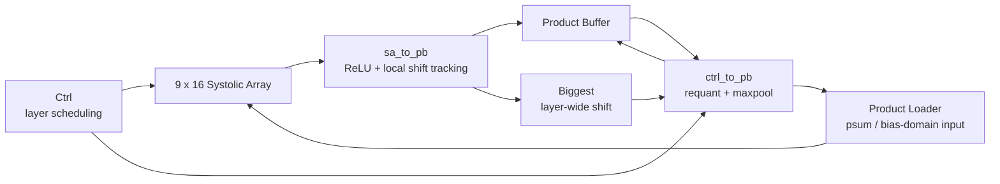

# NPU Architecture

This document describes the Project 2 FPGA NPU from system-level PS-PL integration down to the shared tiled MatMul datapath and the final V2 end-to-end CNN execution architecture.

The project is implemented on a PYNQ-Z2 / Zynq-7020 and uses a 32-bit AXI4-Lite connection between the Processing System (PS) and a custom NPU IP in the Programmable Logic (PL).

---

# 1. System Overview

## 1.1 PS-PL Integration


```text
ARM Cortex-A9
     |
     | M_AXI_GP0
     v
AXI SmartConnect
     |
     | 32-bit AXI4-Lite
     v
Custom NPU IP
```

Platform configuration:

```text
Board            : PYNQ-Z2
SoC              : Zynq-7020
Target clock     : 125 MHz
NPU base address : 0x40000000
PS-PL transport  : 32-bit AXI4-Lite
Compute array    : 9 x 16
Processing PEs   : 144
```

The PS acts as AXI master and the custom accelerator acts as AXI slave. `FCLK_CLK0` supplies the accelerator clock.

---

# 2. Baseline NPU Architecture


The shared accelerator datapath contains:

- Controller;
- Activation Buffer;
- Weight Buffer;
- Input Loader;
- 9 x 16 weight-stationary systolic array;
- Product Loader;
- Product Buffer;
- timing / alignment pipelines.

V2 extends the execution structure around this shared datapath rather than replacing the MAC array.

---

# 3. 9 x 16 Weight-Stationary Systolic Array

The compute array contains:

```text
9 x 16 = 144 processing elements
```

Each PE performs signed INT8 multiply-accumulate work.

Conceptually:

```text
                 output columns
          ------------------------->
        +----+----+----+-----+----+
A[0] -->| PE | PE | PE | ... | PE |
        +----+----+----+-----+----+
A[1] -->| PE | PE | PE | ... | PE |
        +----+----+----+-----+----+
  ...   | .. | .. | .. |     | .. |
        +----+----+----+-----+----+
A[8] -->| PE | PE | PE | ... | PE |
        +----+----+----+-----+----+
```

The physical tile dimensions are:

```text
K tile width  : 9
OC tile width : 16
```

Weights remain stationary in the PE array while activations propagate through the systolic pipeline.

---

# 4. Weight Buffer

The Weight Buffer is organized into 16 logical banks corresponding to the 16 systolic-array columns.

A full weight tile is:

```text
9 x 16
```

Verified V2 Weight Buffer bases are:

```text
Conv1 :     0
Conv2 :    54
Conv3 :   630
Conv4 :  1782
Conv5 :  4086
Conv6 :  7542
FC1   : 12726
FC2   : 13518
```

Weights are packed with K tile outer and output-channel tile inner ordering and are loaded once during startup.

---

# 5. Activation Buffer

The Activation Buffer feeds the 9-row systolic input path.

For a matrix multiplication:

```text
A[S x IC] x W[IC x OC]
```

the K dimension is divided into groups of 9.

```text
K tile 0 : addresses 0 ... S-1
K tile 1 : addresses S ... 2S-1
K tile 2 : addresses 2S ... 3S-1
...
```

If `IC` is not divisible by 9, the final K tile is zero-padded.

Detailed mapping is documented in [Tiling and Buffer Mapping](tiling_logic.md).

---

# 6. Input Loader and Systolic Skew

The Activation Buffer is synchronous memory, so its read data must be aligned before entering the systolic array.

The Input Loader provides row-dependent delay:

```text
common BRAM / pipeline latency
          |
          v
row 0 : +0 relative delay
row 1 : +1
row 2 : +2
...
row 8 : +8
```

This creates the required systolic wavefront.

Corresponding alignment pipelines are also used for weight, control, address, valid, and partial-sum signals.

---

# 7. Product Buffer and Partial-Sum Feedback

The Product Buffer stores systolic-array results and supports accumulation across K tiles.

For the first K tile:

```text
Psum input = 0
```

For later K tiles:

```text
Psum input = previous Product Buffer value
```

Feedback path:

```text
                    +----------------------+
                    |                      |
                    v                      |
Activation --> Systolic Array --> Product Buffer
                    ^                      |
                    |                      |
                    +--- Product Loader <--+
```

V2 additionally uses the Product Buffer / Product Loader path to retain intermediate CNN data inside the PL between weighted layers.

---

# 8. Tiled MatMul Execution

The physical 9 x 16 array is reused across both K and output-channel dimensions.

```text
for each K tile:
    select activation tile

    for each OC tile:
        load 9 x 16 weight tile

        if first K tile:
            Psum = 0
        else:
            Psum = Product Buffer feedback

        stream activations
        execute systolic MACs
        store updated product tile
```

---

# 9. V1 — PS-Managed CNN Execution

In V1, the PS is responsible for network-level orchestration.

```text
PS
 |
 |-- prepare / im2col activation
 |-- load activation
 |-- configure S / IC
 |-- configure OC / WOffset
 |-- execute MatMul
 |-- poll status
 |-- read Product Buffer
 |-- ReLU / pool / requantize in software
 `-- prepare next layer
```

This results in repeated PS-PL communication between weighted layers.

Dominant payload count:

```text
im2col activation LOAD : 637,920
Product Buffer READ    : 110,730
--------------------------------
Total                  : 748,650 / image
```

---

# 10. V2 — End-to-End PL Extension

V2 keeps the same external AXI4-Lite system and the same 9 x 16 systolic array, but moves CNN scheduling and intermediate processing into the PL.

```text
PS
 |
 |-- CIFAR-10 mean/std normalization
 |-- global signed INT8 input quantization
 |-- per-image input-scale metadata
 |-- 3072 INT8 RGB values
 |
 v
+--------------------------------------------------+
|                       PL                         |
|                                                  |
| Conv1 -> ReLU -> Requant                         |
|   -> Conv2 -> ReLU -> Pool -> Requant            |
|   -> Conv3 -> ReLU -> Requant                    |
|   -> Conv4 -> ReLU -> Pool -> Requant            |
|   -> Conv5 -> ReLU -> Requant                    |
|   -> Conv6 -> ReLU -> Pool                       |
|   -> GAP -> Requant                              |
|   -> FC1 -> ReLU -> Requant                      |
|   -> FC2                                         |
|                                                  |
| Intermediate feature data remains inside PL.     |
+-------------------------+------------------------+
                          |
                          v
                    10 final logits
```

There is no normal PS intervention between Conv/FC layers once the V2 image input has been staged.

---

# 11. V2 Convolution / Window Generation

The target network uses 3 x 3 stride-1, padding-1 convolutions.

V1 constructs `im2col` data in software. V2 instead performs local window generation / im2col-equivalent scheduling inside the PL.

Conceptually:

```text
Feature map
    |
    v
3 x 3 local window generation
    |
    v
A[S x K], K = Cin x 9
    |
    v
9-wide K tiles
    |
    v
9 x 16 systolic array
```

The 1024-deep Activation Buffer organization is retained; larger logical tensors are handled by scheduling rather than by increasing the primary BRAM footprint.

---

# 12. V2 Post-Processing Partition

The added functionality is distributed across local modules.

| Block | Main responsibility |
|---|---|
| `Ctrl` | CNN/layer scheduling, pool/GAP sequencing, control |
| `sa_to_pb` | ReLU and local shift-candidate tracking |
| `Biggest` | layer-wide maximum shift selection |
| `ctrl_to_pb` | shift requantization, rounding, pooling, result steering |
| Product Loader | partial-sum / bias-domain input selection |
| Product Buffer | intermediate / final data storage and feedback |



---

# 13. Layer-Wide Shift Requantization

V2 approximates intermediate activation scaling with a power-of-two shift:

```text
q = round(x / 2^shift)
```

Conceptually:

```text
systolic output
      |
      v
ReLU
      |
      v
shift-candidate tracking
      |
      v
layer-wide maximum shift
      |
      v
right shift + rounding
      |
      v
INT8 activation
```

One shift is used for the complete layer output tensor rather than independently per output channel.

---

# 14. Pooling and GAP

V2 performs 2 x 2 max pooling inside the PL after Conv2, Conv4, and Conv6.

```text
32 x 32 -> 16 x 16
16 x 16 ->  8 x 8
 8 x  8 ->  4 x 4
```

After the final pooling stage, GAP reduces 16 spatial values per channel:

```text
sum16 = x0 + x1 + ... + x15
GAP   = round(sum16 / 16)
```

Since `16 = 2^4`, division is implemented as a 4-bit right shift with rounding.

---

# 15. Verified V2 Parameter Staging

The final host contract is:

```text
Startup once
------------
all INT8 weights
parameters 0..521   : bias_over_ws_q16
parameters 522..529 : inv_weight_scale_q16

Per image
---------
parameter 530       : inv_input_scale_q16
R channel           : 1024 INT8 values
G channel           : 1024 INT8 values
B channel           : 1024 INT8 values
```

Parameters 0..529 are model-static in the verified implementation. Only parameter 530 is image-dependent.

---

# 16. V2 Steady-State Communication

```text
Parameter 530 LOW/HIGH :    2 writes
RGB activation         : 3072 writes
Final logits           :   10 reads
--------------------------------
Total                  : 3084 payload transactions / image
```

Compared with V1's 748,650 dominant payload transactions/image, V2 reduces the steady-state metric by approximately 99.59%.

---

# 17. V2 Timing and Resource Result

Timing:

```text
Target clock : 125 MHz
Worst slack  : +0.119 ns
```

Resources:

| Resource | V1 | V2 |
|---|---:|---:|
| LUT | 3,060 | 4,477 |
| LUTRAM | 560 | 1,042 |
| FF | 6,175 | 7,649 |
| BRAM | 116.5 | 116.5 |
| DSP | 144 | 144 |

The main DSP and BRAM footprint is unchanged while additional control and post-processing consume extra LUT/LUTRAM/FF resources.

---

# 18. Validated V2 Inference Path

The final Vitis implementation achieved:

```text
Accuracy : 91.5%
Latency  : 5.004 ms / image
```

The PYNQ/Jupyter implementation reproduced the same 91.5% accuracy over the 1,000-image validation path before live-camera input was used.

---

# 19. Live-Demo System Integration

The live-camera demonstration does not modify the V2 RTL architecture. It adds a PYNQ Linux input/display path around the same verified hardware.

```text
HCAM01L USB Webcam
        |
        | USB / V4L2
        v
PYNQ Linux / OpenCV
        |
        v
center crop + resize to 32 x 32
        |
        v
BGR -> RGB
        |
        v
mean/std normalization
        |
        v
global signed INT8 quantization
        |
        +-- parameter 530
        |
        v
32-bit AXI4-Lite
        |
        v
V2 Custom NPU IP
        |
        | Conv1 -> ... -> FC2
        v
10 logits
        |
        v
argmax / class label
        |
        v
Jupyter live display
```

The final demo showed approximately `5 FPS` at the complete application/display level.

This result is not directly comparable with the controlled `5.004 ms/image` Vitis benchmark.

---

# 20. Project Scope Decision

An activation row-level ZeroSkip extension was considered as a possible next architecture.

However, the final system showed:

```text
Controlled V2 benchmark : 5.004 ms / image
Live PYNQ/Jupyter demo   : ~5 FPS (~200 ms / displayed frame)
```

Because these scopes differ, they should not be converted directly into an RTL speedup. Nevertheless, the gap shows that practical live-demo throughput is no longer primarily limited by several milliseconds of MAC execution.

Therefore, ZeroSkip was not implemented as part of Project 2. The project is concluded at V2.

Further live-video improvement should focus on profiling and optimizing the host/runtime/display path rather than only reducing MAC cycles.
