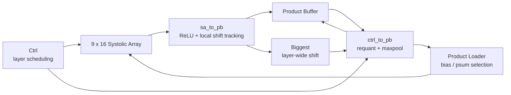

# NPU Architecture

This document describes the architecture of the Project 2 FPGA NPU from the
system level down to the internal tiled MatMul datapath.

Sections 1-14 document the **Baseline (V1)** architecture, where the
Processing System (PS) manages CNN-level execution and the Programmable
Logic (PL) primarily executes tiled matrix multiplication. The later
sections document the implemented **V2 end-to-end PL extension**.

The architecture is described at three levels:

1. system-level PS-PL integration on the Zynq-7020;
2. the shared 9 x 16 tiled MatMul datapath;
3. the V2 scheduling and post-processing logic added around the shared datapath.

---

# 1. System Overview

## 1.1 PS–PL System Integration

The Baseline is implemented on the **PYNQ-Z2**, which contains a
Xilinx Zynq-7020 SoC.

The ARM Cortex-A9 Processing System controls the custom NPU IP through
a 32-bit AXI4-Lite interface.


The system-level communication path is:

```text
ARM Cortex-A9
     │
     │ M_AXI_GP0
     ▼
AXI SmartConnect
     │
     │ 32-bit AXI4-Lite
     ▼
Custom NPU IP
     │
     ▼
Baseline MatMul Engine
```

The Processing System acts as the **AXI master**, while the custom NPU
IP acts as the **AXI slave**.

`FCLK_CLK0` from the Zynq Processing System provides the clock used by
the AXI interconnect and the custom PL accelerator. The corresponding
reset is distributed through the Processor System Reset block.

The custom NPU IP contains the Activation Buffer, Weight Buffer,
Product Buffer, controller, systolic array, and associated datapath
logic.

The same system-level Block Design and PS–PL interface are intended to
be maintained across the V1, V2, and V3 engines. Architectural changes
are therefore concentrated inside the custom NPU IP rather than in the
external PS–PL interconnect.

---

## 1.2 Processing System (PS)

For each convolution or fully connected layer, the PS:

- prepares the input data required by the next matrix multiplication;
- performs convolution-specific preprocessing such as `im2col`;
- performs layer-level post-processing in software when required;
- requantizes intermediate results before they are used by the next layer;
- loads activation data into the Activation Buffer;
- loads weight data into the Weight Buffer;
- configures the matrix dimensions and weight-buffer offset;
- starts the MatMul engine;
- polls the PL status;
- reads the resulting product matrix from the Product Buffer.

Therefore, intermediate feature maps are repeatedly transferred between
the PS and PL.

This behavior is intentional. The Baseline provides a reference
architecture for evaluating the benefit of moving CNN scheduling and
intermediate processing into the PL in later versions.

---

## 1.3 Programmable Logic (PL)

The PL is responsible for executing the configured tiled matrix
multiplication.

The PL receives:

- weight data;
- activation data;
- `S`;
- `IC`;
- `OC`;
- `WOffset`;
- an execute command.

The MatMul engine then:

1. loads the required weight tile;
2. streams the corresponding activation tile;
3. performs MAC operations using the 9 × 16 weight-stationary
   systolic array;
4. accumulates partial sums across K tiles when required;
5. stores the final product tiles in the Product Buffer;
6. asserts completion status for the PS.

---

# 2. Baseline NPU Architecture

The custom NPU IP shown in the Vivado Block Design contains the
Baseline MatMul accelerator shown below.


At the system level, the complete accelerator is exposed to the PS as
a single AXI4-Lite slave IP.

Internally, the accelerator consists of:

- Controller;
- Activation Buffer;
- Weight Buffer;
- Input Loader;
- 9 × 16 weight-stationary systolic array;
- Product Loader;
- Product Buffer;
- pipeline and timing-alignment logic.

The PS communicates with the controller through the AXI slave
interface. The controller then coordinates the internal buffers and
datapath to execute the requested tiled matrix multiplication.

The following sections describe each component in detail.

---

# 3. AXI4-Lite Interface

The PS communicates with the accelerator through a 32-bit AXI4-Lite
interface.

The PS acts as the **AXI master**, while the custom accelerator IP acts
as the **AXI slave**.

The Baseline command interface uses the following offsets:

| Offset | Command | Direction | Description |
|---:|---|---|---|
| `0x00` | Response | PL → PS | Returns accelerator status and Product Buffer readback data |
| `0x04` | Load Weight | PS → PL | Writes one INT8 weight value to the Weight Buffer |
| `0x08` | Load Activation | PS → PL | Writes one INT8 activation value to the Activation Buffer |
| `0x0C` | Configure / Execute | PS → PL | Configures `S`, `IC`, `OC`, `WOffset`, and starts MatMul |
| `0x10` | Read Product Buffer | PS → PL | Requests one Product Buffer value |

The response code has the format:

```verilog
{BUSY, DONE, PENDING, VALID, DATA[27:0]}
```

where:

- `BUSY` indicates that the MatMul engine is currently executing;
- `DONE` indicates that the configured MatMul operation has completed;
- `PENDING` indicates that a Product Buffer read request is being processed;
- `VALID` indicates that the returned Product Buffer data is valid.

The Baseline uses **polling** rather than interrupts.

---

# 4. MatMul Configuration

A matrix multiplication is represented as:

```text
A[S × IC] × W[IC × OC] = P[S × OC]
```

The controller receives four main configuration parameters.

## `S`

`S` is the number of rows in the activation matrix.

For convolution, it corresponds to the number of output spatial
positions after `im2col`.

## `IC`

`IC` is the GEMM K dimension.

For a 3 × 3 convolution:

```text
IC = Cin × 3 × 3
```

## `OC`

`OC` is the number of output columns of the matrix multiplication.

For convolution, this corresponds to the number of output channels.

## `WOffset`

`WOffset` specifies the starting address of the current layer's weights
in the Weight Buffer.

---

# 5. Controller

The controller manages the complete tiled MatMul execution.

Its main responsibilities are:

- decoding AXI commands;
- storing the current MatMul configuration;
- generating Activation Buffer, Weight Buffer, and Product Buffer addresses;
- controlling K-dimension tiling;
- controlling output-column tiling;
- generating the active-column mask for partial output tiles;
- loading weights into the systolic array;
- streaming activation vectors;
- requesting previous partial sums from the Product Buffer;
- detecting the final output transaction;
- generating `BUSY`, `DONE`, `PENDING`, and `VALID`.

The controller does not use a separate encoded FSM. Execution is
controlled using phase flags and counters for weight loading,
activation streaming, and final-output waiting.

The controller is therefore responsible for most of the global
scheduling and address-generation logic in the Baseline accelerator.

---

# 6. Activation Buffer

The Activation Buffer is organized into **9 banks**, matching the
9 rows of the systolic array.

One buffer address therefore provides a 9-element activation vector in
parallel.

For:

```text
A[S × IC]
```

the activation matrix is divided into K tiles of width 9.

Conceptually:

```text
K tile 0 : address 0       ~ S-1
K tile 1 : address S       ~ 2S-1
K tile 2 : address 2S      ~ 3S-1
...
```

If `IC` is not a multiple of 9, the final activation tile is
zero-padded.

This allows the same 9-row datapath to be used for every K tile without
special handling in the processing elements.

The detailed activation mapping and tiling scheme is described in
[Tiling and Buffer Mapping](tiling_logic.md).

---

# 7. Weight Buffer

The Weight Buffer is organized into **16 banks**, matching the
16 systolic-array columns.

A full weight tile therefore has size:

```text
9 × 16
```

Each weight tile occupies 9 addresses across 16 banks.

The weight-loading path contains pipeline stages between the
controller, synchronous BRAM, and systolic array. These stages align
weight data with the corresponding weight-enable and row-ID control
signals.

During weight loading, the controller selects the current 9 × 16 tile
and loads its nine rows into the weight-stationary PE array.

Once loaded, the weights remain stationary while activation vectors
are streamed through the array.

The detailed Weight Buffer mapping is described in
[Tiling and Buffer Mapping](tiling_logic.md).

---

# 8. 9 × 16 Weight-Stationary Systolic Array

The core computation engine is a **9 × 16 weight-stationary systolic
array**.

It contains:

```text
9 × 16 = 144 processing elements
```

Each PE performs an INT8 multiply-accumulate operation:

```verilog
Psum_Out <= Data_I_In * Data_W_Buf + Psum_In;
```

Weights are stored locally in the PEs during the weight-loading phase.

Activation values propagate horizontally across the array, while
partial sums and associated metadata propagate through the processing
pipeline.

The accumulated product uses a signed 25-bit partial-sum datapath.

Conceptually:

```text
                 Output columns
          ─────────────────────────►

        ┌────┬────┬────┬───────┬────┐
A[0] ──►│ PE │ PE │ PE │  ...  │ PE │
        ├────┼────┼────┼───────┼────┤
A[1] ──►│ PE │ PE │ PE │  ...  │ PE │
        ├────┼────┼────┼───────┼────┤
  ...   │ .. │ .. │ .. │       │ .. │
        ├────┼────┼────┼───────┼────┤
A[8] ──►│ PE │ PE │ PE │  ...  │ PE │
        └────┴────┴────┴───────┴────┘

          9 rows × 16 columns
```

The 9-row dimension determines the K-tile width, while the 16-column
dimension determines the number of output channels that can be
processed in parallel.

---

# 9. Input Loader and Systolic Input Skewing

The Activation Buffer is synchronous memory, so its read data does not
arrive in the same cycle as the controller request.

The Input Loader delays and aligns the activation data before it enters
the systolic array.

The row-dependent delay is a form of **systolic input skewing**. Different
array rows receive incrementally staggered activation streams so that the
required systolic wavefront is formed. The exact absolute latency includes
the common BRAM/pipeline delay; the important point is the relative
row-dependent skew between activation streams.

Conceptually:

```text
Common BRAM / pipeline latency
          |
          v
Row 0 : +0 relative delay
Row 1 : +1 relative delay
Row 2 : +2 relative delay
 ...
Row 8 : +8 relative delay
```

This staggered injection ensures that activation data reaches the correct PE
at the correct clock cycle.

Similar pipeline modules are used on the weight, control, and product
paths to keep:

- data;
- addresses;
- valid signals;
- enable signals;
- partial sums

aligned with each other.

The small pipeline blocks shown in the architecture diagram represent
these timing-alignment modules.

---

# 10. Product Buffer and Partial-Sum Feedback

The Product Buffer stores the outputs generated by the systolic array.

It is organized into **16 banks**, corresponding to the 16 output
columns of the systolic array.

For one output-column tile, `S` Product Buffer addresses are used.

Conceptually:

```text
OC tile 0 : address 0       ~ S-1
OC tile 1 : address S       ~ 2S-1
OC tile 2 : address 2S      ~ 3S-1
...
```

When the K dimension requires multiple tiles, the first K tile starts
with a zero partial sum.

For later K tiles, the previously stored partial sum is read from the
Product Buffer and returned to the systolic array through the Product
Loader.

Therefore:

```text
First K tile:
    Psum input = 0

Later K tiles:
    Psum input = previous Product Buffer value
```

The feedback path can be summarized as:

```text
                    ┌───────────────────────┐
                    │                       │
                    ▼                       │
Activation ──► Systolic Array ──► Product Buffer
                    ▲                       │
                    │                       │
                    └──── Product Loader ◄──┘
```

This allows the accelerator to accumulate multiple K tiles into the
same final output tile.

---

# 11. Tiled MatMul Execution

The 9 × 16 physical array cannot necessarily process an entire matrix
multiplication in one pass.

The matrix multiplication:

```text
A[S × IC] × W[IC × OC]
```

is therefore decomposed along two dimensions.

## K-Dimension Tiling

The `IC` dimension is divided into groups of 9:

```text
K tile width = 9
```

If:

```text
IC > 9
```

multiple K tiles are processed and accumulated through the Product
Buffer feedback path.

## Output-Column Tiling

The `OC` dimension is divided into groups of 16:

```text
OC tile width = 16
```

If:

```text
OC > 16
```

multiple output-column tiles are executed sequentially.

Therefore, the physical 9 × 16 array is reused across both dimensions.

The implemented Baseline packing/execution order keeps the K tile as the
outer tiled loop and reuses the corresponding activation tile across the
output-column tiles.

Conceptually:

```text
for each K tile:

    select / reuse the activation tile

    for each OC tile:

        load 9 x 16 weight tile
        stream the activation tile

        if first K tile:
            Psum = 0
        else:
            Psum = Product Buffer feedback

        execute systolic array
```

For a given output-column tile, contributions from successive K tiles are
accumulated through the Product Buffer feedback path until the final product
tile is complete.

Detailed examples of the matrix-to-buffer mapping and tiling order are
provided in [Tiling and Buffer Mapping](tiling_logic.md).

---

# 12. Baseline Layer Execution Flow

A typical convolution or fully connected layer is executed as follows:

```text
PS
 │
 ├─ Prepare / preprocess activation data
 ├─ Perform im2col for convolution
 ├─ Requantize input if required
 ├─ Load weights
 ├─ Load activations
 ├─ Configure S and IC
 ├─ Configure OC and WOffset
 └─ Execute
        │
        ▼
PL MatMul
 │
 ├─ Load weight tile
 ├─ Stream activation tile
 ├─ Execute 9 × 16 systolic-array MACs
 ├─ Accumulate partial sums across K tiles
 └─ Store final products in Product Buffer
        │
        ▼
PS
 │
 ├─ Read Product Buffer
 ├─ Perform layer-specific post-processing
 ├─ Requantize for the next layer
 ├─ Prepare the next MatMul input
 └─ Start the next MatMul operation
```

The PL accelerates the matrix multiplication itself, while the PS
remains responsible for CNN-level orchestration.

As a result, a complete CNN inference requires repeated PS–PL
interaction.

---

# 13. Role of the Baseline

The Baseline is intentionally PS-managed.

Its purpose is not to minimize PS–PL communication, but to provide a
controlled reference architecture.

The main limitation is that intermediate results repeatedly cross the
PS–PL boundary:

```text
PS preprocessing
      ↓
PL MatMul
      ↓
PS post-processing / requantization
      ↓
PL MatMul
      ↓
     ...
```

This creates:

- repeated AXI transactions;
- repeated Product Buffer readback;
- repeated PS intervention;
- repeated software-side layer scheduling;
- communication overhead between CNN layers.

The Baseline therefore provides the reference point for the V2
architecture.

V2 retains the same fundamental matrix-multiplication datapath while moving
network-level scheduling and intermediate processing into the PL. V2 has now
been implemented and is described in the extension sections below.

Conceptually:

```text
V1

PS
 │
 ├── layer scheduling
 ├── intermediate processing
 ├── requantization
 │
 ▼
PL MatMul
 │
 ▼
PS
 │
 ▼
PL MatMul
 │
 ▼
...


V2 implemented direction

PS
 │
 ├── input preprocessing
 └── START
       │
       ▼
┌──────────────────────────────┐
│              PL              │
│                              │
│ CNN scheduling               │
│      ↓                       │
│ MatMul                       │
│      ↓                       │
│ ReLU / Requantization        │
│      ↓                       │
│ Pooling / Feedback           │
│      ↓                       │
│ Next Layer                   │
│      ↓                       │
│ ...                          │
│      ↓                       │
│ Classification               │
└──────────────┬───────────────┘
               │
               ▼
              PS
```

This makes the Baseline a direct reference point for measuring the
benefit of end-to-end PL execution.

---

# 14. Baseline Architecture Summary

The complete system can be viewed at two abstraction levels.

## System Level

```text
PYNQ-Z2 / Zynq-7020

┌───────────────────────┐
│ Processing System     │
│ ARM Cortex-A9         │
└──────────┬────────────┘
           │
           │ M_AXI_GP0
           ▼
┌───────────────────────┐
│ AXI SmartConnect      │
└──────────┬────────────┘
           │
           │ AXI4-Lite
           ▼
┌───────────────────────┐
│ Custom NPU IP         │
│ Programmable Logic    │
└───────────────────────┘
```

## Accelerator Level

```text
PS
 │
 │ AXI4-Lite
 ▼
Controller
 │
 ├──────────────► Weight Buffer
 │                       │
 │                       ▼
 │                Weight Pipeline
 │                       │
 │                       │
 ├──► Activation Buffer  │
 │          │            │
 │          ▼            │
 │     Input Loader      │
 │          │            │
 │          └──────┬─────┘
 │                 ▼
 │        9 × 16 Weight-Stationary
 │           Systolic Array
 │                 │
 │                 ▼
 │          Product Buffer
 │                 │
 │                 ├────► PS Readback
 │                 │
 │                 ▼
 └────────── Product Loader
                   │
                   └────► Psum Feedback
```

Key characteristics of the Baseline are:

- **PYNQ-Z2 / Zynq-7020 platform**
- **32-bit AXI4-Lite PS–PL interface**
- **PS-managed CNN execution**
- **PL-based tiled matrix multiplication**
- **9 × 16 weight-stationary systolic array**
- **144 INT8 MAC processing elements**
- **25-bit signed partial-sum datapath**
- **9-bank Activation Buffer**
- **16-bank Weight Buffer**
- **16-bank Product Buffer**
- **K-dimension tiling with zero-padding**
- **16-column output tiling**
- **output-column valid masking**
- **Product Buffer partial-sum feedback**
- **AXI4-Lite polling-based control**
- **intermediate result transfer back to the PS between layers**

The system-level PS–PL interface is maintained as the common platform
for the later V2 and V3 engines, while the internal NPU execution
architecture is progressively modified.

---

# 15. V2 End-to-End PL Extension

V2 keeps the same system-level AXI4-Lite Block Design, 9 x 16
weight-stationary systolic array, Weight Buffer, Activation Buffer, Product
Buffer, and tiled MatMul structure used by V1.

The main architectural change is **where CNN orchestration occurs**.

In V1, the PS repeatedly prepares a layer, starts a MatMul, reads the Product
Buffer, performs post-processing, and then prepares the next layer. In V2,
Conv1 through FC2 are scheduled inside the PL after the per-image input and
bias parameters have been staged.

The implemented V2 partition is:

```text
PS
 |
 |-- original CIFAR-10 normalization / input quantization
 |-- per-image scaled-bias preparation
 |
 +-- scaled bias parameters
 +-- 3 x 32 x 32 INT8 RGB input
 |
 v
+-----------------------------------------------------------+
|                           PL                              |
|                                                           |
|   CNN / tile scheduling                                   |
|          |                                                |
|          v                                                |
|   Im2col / activation preparation                         |
|          |                                                |
|          v                                                |
|   Shared 9 x 16 tiled MatMul datapath                     |
|          |                                                |
|          v                                                |
|   ReLU -> max/shift detect -> requantization -> pooling   |
|          |                                                |
|          +---------------------> Product Buffer feedback  |
|          |                                                |
|          v                                                |
|      next layer ... -> GAP -> FC1 -> FC2                  |
+--------------------------+--------------------------------+
                           |
                           v
                       10 logits
                           |
                           v
                           PS
```

The critical distinction is that **there is no PS intervention between
Conv/FC layers once V2 execution has started**. Intermediate feature maps
remain in the PL and are fed directly into the next layer's execution flow.

---

# 16. V2 Convolution and Im2col Support

The target CNN uses 3 x 3 stride-1, padding-1 convolutions. The Baseline
constructs `im2col` data in software before loading the accelerator.

V2 moves this preparation into the PL execution path. The RTL uses local
register/buffer logic around the activation path to generate the 3 x 3
windows required by the tiled MatMul engine rather than asking the PS to
materialize and transmit the complete im2col matrix. For a 32-pixel-wide
feature map with one-pixel zero padding, the local window-generation context
is organized around a **3 x 34** padded-row register structure.

The high-level relation remains:

```text
Feature map
    |
    v
3 x 3 window generation / im2col-equivalent scheduling
    |
    v
A[S x K],  K = Cin x 9
    |
    v
9-wide K tiles
    |
    v
9 x 16 systolic array
```

The 1024-deep Activation Buffer organization is retained. Larger logical
feature maps are handled by channel/tile scheduling rather than increasing
the BRAM depth to hold every logical tensor in one monolithic buffer.

---

# 17. V2 Post-Processing Datapath

V2 distributes the added post-processing work across local modules instead
of placing every function in one large centralized controller datapath.

The main functional blocks are:

| Block | V2 responsibility |
|---|---|
| `Ctrl` | CNN/layer scheduling, pooling/GAP sequencing, bias/requant control |
| `sa_to_pb` | ReLU and local maximum/shift tracking on SA outputs |
| `Biggest` | reduction of shift candidates to the layer-wide shift requirement |
| `ctrl_to_pb` | shift-based requantization, max pooling, and bias transport control |
| `Product Loader` | selects the proper initial/feedback partial-sum source, including bias injection |
| Product Buffer | stores intermediate/final products and supports next-stage feedback |

The implemented dataflow can be summarized as:



This structure also reflects the V1 timing observation that the centralized
controller/control-distribution network was already close to the 125 MHz
limit. Localizing post-processing helps keep added arithmetic away from the
main global control path.

---

# 18. ReLU and Layer-Wide Shift Detection

After a weighted layer produces a valid accumulator result, `sa_to_pb`
performs ReLU when enabled:

```text
x < 0  -> 0
x >= 0 -> x
```

At the same time, it records the magnitude information required for
power-of-two requantization.

The shift is **not reset per output channel**. The shift decision represents
the activation tensor/layer output that will become the next weighted
layer's INT8 input. `Biggest` combines the valid shift candidates and
provides the maximum required shift to the downstream control path.

Conceptually:

```text
SA outputs from all valid OC tiles
            |
            v
      ReLU + shift candidates
            |
            v
         Biggest
            |
            v
    one layer-wide shift
            |
            v
       ctrl_to_pb
```

---

# 19. Shift-Based Requantization and Pooling

The original software reference uses an arbitrary activation scale derived
from the activation range. V2 replaces the intermediate rescaling operation
with a power-of-two approximation that is directly implementable using a
right shift and rounding.

Conceptually:

```text
q = round(x / 2^shift)
```

The RTL uses the shifted value plus the highest discarded bit as the rounding
term and then saturates the result to the target INT8 range.

For blocks containing max pooling, `ctrl_to_pb` combines the required 2 x 2
values and only emits the pooled result when the complete pooling group has
arrived.

For the final 4 x 4 Global Average Pooling stage, 16 values per channel are
accumulated and division by 16 is implemented as a 4-bit right shift with
rounding:

```text
sum16 = x0 + x1 + ... + x15
GAP   = (sum16 >> 4) + rounding_bit(bit 3)
```

The GAP result is then saturated/requantized before FC1.

---

# 20. Bias Injection

A weighted-layer output is conceptually:

```text
Product = Bias + Weight x Activation
```

In integer inference, the bias must be represented in the same accumulator
scale as the INT8 x INT8 MAC result. Conceptually:

```text
bias_acc ~= bias_real / (activation_scale x weight_scale)
```

The V2 development evaluated two bias-handling approaches.

### Initial hardware-rescaling approach

Bias was preloaded and the PL attempted to adapt it as the activation scale
changed. The resulting full-dataset accuracy was only:

```text
103 / 1000 = 10.3%
```

### Accepted V2 approach

The PS prepares activation-scale-dependent bias values in the model-consistent
Q32 form and loads all 522 bias values for the current image before V2
execution.

```text
Conv1 :  32 biases
Conv2 :  32
Conv3 :  64
Conv4 :  64
Conv5 :  96
Conv6 :  96
FC1   : 128
FC2   :  10
----------------
Total : 522 biases
```

The Product Loader path carries the selected bias into the partial-sum input
for the beginning of the corresponding accumulation so that the systolic
array computes the biased product without requiring a PS-side intermediate
feature-map round trip.

This approach restores the verified V2 accuracy to:

```text
915 / 1000 = 91.5%
```

---

# 21. V2 Execution Workflow

Weights are still treated as model-static data and are preloaded at startup.
The per-image workflow is:

```text
Startup
  |
  +-- preload all weights

Per image
  |
  +-- PS normalization / INT8 input quantization
  |
  +-- prepare + load 522 scaled bias values
  |
  +-- load 3072 RGB activation values
  |
  +-- start / enter end-to-end V2 execution
  |
  +-- PL: Conv1 -> ... -> Conv6 -> GAP -> FC1 -> FC2
  |
  +-- read 10 logits
```

The dominant payload-transfer count used in the research report is therefore:

```text
Bias writes  :  522
RGB writes   : 3072
Logit reads  :   10
-------------------
Total        : 3604 handshakes / image
```

The Baseline equivalent count is 748,650 payload handshakes per image, so V2
reduces this communication count by approximately 99.52%.

---

# 22. V1 vs. V2 Architectural Delta

The comparison is intentionally incremental.

| Component | V1 | V2 |
|---|---|---|
| System Block Design | fixed | same |
| AXI4-Lite PS-PL link | fixed | same |
| 9 x 16 SA | tiled MatMul | reused |
| DSP count | 144 | 144 |
| BRAM footprint | 116.5 | 116.5 |
| Layer scheduling | PS | PL |
| im2col preparation | PS | PL-local generation/scheduling |
| ReLU | PS | PL |
| Requantization | PS | PL shift + rounding |
| MaxPool | PS | PL |
| GAP | PS | PL |
| Intermediate PB readback | repeated | removed from normal layer flow |
| Bias preparation | PS/software reference | PS per-image scaled bias load; PL bias injection |
| Final output transfer | intermediate matrices + final result | 10 logits |

The V2 implementation therefore changes the **execution partition** much more
than the core MAC array itself. This is why DSP and BRAM usage remain unchanged
while LUT/LUTRAM/FF increase to support the added control and post-processing
logic.

---

# 23. V3 Direction

The next architecture is V3: V2 plus **activation row-level ZeroSkip**.

The earlier draft used the term column-level ZeroSkip. The current research
plan has been revised to row-level activation skipping. The final zero-detect
granularity and scheduling protocol have not yet been frozen, so V3 details
should be documented only after the RTL design is finalized.

The intended high-level behavior is:

```text
Scheduled activation row
          |
          v
      all zero ?
       /    \
     yes     no
      |       |
      v       v
    skip    execute
             SA work
```

V2 is the controlled reference for measuring the cycle, timing, resource,
power, and energy impact of that optimization.

