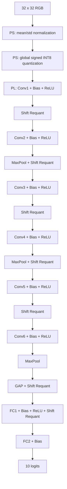

# Model 2 — CIFAR-10 Inference Model

## Overview

Model 2 is a compact VGG-style convolutional neural network used for CIFAR-10 image classification.

Input:

```text
3 x 32 x 32 RGB image
```

Output:

```text
10 class logits
```

The model contains:

- 6 convolution layers;
- ReLU after each convolution layer;
- 3 max-pooling layers;
- Global Average Pooling (GAP);
- 2 fully connected layers.

All convolution layers use:

```text
Kernel size : 3 x 3
Stride      : 1
Padding     : 1
```

---

# 1. Model Architecture


```text
Input RGB Image
3 x 32 x 32
      |
      v
Input Normalization
      |
      v
Conv1: 3 -> 32
ReLU
      |
      v
32 x 32 x 32
      |
      v
Conv2: 32 -> 32
ReLU
      |
      v
MaxPool 2 x 2
      |
      v
32 x 16 x 16
      |
      v
Conv3: 32 -> 64
ReLU
      |
      v
64 x 16 x 16
      |
      v
Conv4: 64 -> 64
ReLU
      |
      v
MaxPool 2 x 2
      |
      v
64 x 8 x 8
      |
      v
Conv5: 64 -> 96
ReLU
      |
      v
96 x 8 x 8
      |
      v
Conv6: 96 -> 96
ReLU
      |
      v
MaxPool 2 x 2
      |
      v
96 x 4 x 4
      |
      v
Global Average Pooling
      |
      v
96
      |
      v
FC1: 96 -> 128
ReLU
      |
      v
128
      |
      v
FC2: 128 -> 10
      |
      v
10 logits
```

---

# 2. Layer Specification

| Layer | Input | Operation | Output |
|---|---|---|---|
| Input | RGB | normalization | `3 x 32 x 32` |
| Conv1 | `3 x 32 x 32` | 3x3, 3->32, ReLU | `32 x 32 x 32` |
| Conv2 | `32 x 32 x 32` | 3x3, 32->32, ReLU | `32 x 32 x 32` |
| MaxPool1 | `32 x 32 x 32` | 2x2 / stride 2 | `32 x 16 x 16` |
| Conv3 | `32 x 16 x 16` | 3x3, 32->64, ReLU | `64 x 16 x 16` |
| Conv4 | `64 x 16 x 16` | 3x3, 64->64, ReLU | `64 x 16 x 16` |
| MaxPool2 | `64 x 16 x 16` | 2x2 / stride 2 | `64 x 8 x 8` |
| Conv5 | `64 x 8 x 8` | 3x3, 64->96, ReLU | `96 x 8 x 8` |
| Conv6 | `96 x 8 x 8` | 3x3, 96->96, ReLU | `96 x 8 x 8` |
| MaxPool3 | `96 x 8 x 8` | 2x2 / stride 2 | `96 x 4 x 4` |
| GAP | `96 x 4 x 4` | average 16 values/channel | `96` |
| FC1 | `96` | fully connected + ReLU | `128` |
| FC2 | `128` | fully connected | `10` |

---

# 3. CIFAR-10 Classes

```text
0 : airplane
1 : automobile
2 : bird
3 : cat
4 : deer
5 : dog
6 : frog
7 : horse
8 : ship
9 : truck
```

---

# 4. Input Preprocessing

The input image consists of unsigned 8-bit RGB pixels.

First:

```text
x = pixel / 255
```

Then channel-wise normalization:

```text
x_norm = (x - mean) / std
```

using:

```text
mean = (0.4914, 0.4822, 0.4465)
std  = (0.2470, 0.2435, 0.2616)
```

Therefore the raw `0..255` pixel values are not directly used as Conv1 operands.

---

# 5. V2 Initial INT8 Quantization

After mean/std normalization, the verified V2 host path uses one signed-symmetric scale over the complete normalized RGB tensor.

```text
3 x 32 x 32 = 3072 values
```

The host computes:

```text
max_abs = max(abs(x_norm))
input_scale = max_abs / 127
```

with a safe fallback if `max_abs == 0`.

Quantization uses round-to-even behavior:

```text
q_input = round_to_even(x_norm / input_scale)
q_input = clip(q_input, -128, 127)
```

The PL receives the values in channel-first order:

```text
R[0..1023]
G[0..1023]
B[0..1023]
```

---

# 6. Image-Dependent Input Scale Metadata

The host computes:

```text
inv_input_scale_q16
    ~= round((1 / input_scale) * 2^16)
```

This value is written as:

```text
Parameter 530
```

before the image is uploaded.

Parameter 530 is the only image-dependent parameter in the final verified host interface.

---

# 7. Convolution

For output channel `o` and spatial position `(h, w)`:

```text
y[o,h,w]
    =
    sum x[c,h+i,w+j] * W[o,c,i,j]
    + bias[o]
```

For a 3 x 3 convolution:

```text
K = Cin x 3 x 3
  = 9 x Cin
```

Examples:

```text
Conv1 : K = 27
Conv2 : K = 288
Conv3 : K = 288
Conv4 : K = 576
Conv5 : K = 576
Conv6 : K = 864
```

The accelerator processes the K dimension in 9-element physical tiles.

---

# 8. Quantized Weighted-Layer Datapath

Weighted operations use:

```text
INT8 activation
      x
INT8 weight
      |
      v
wide signed accumulation
```

The physical MAC engine is the 9 x 16 weight-stationary systolic array.

The accumulator result is combined with the required V2 bias/scale metadata and passed through layer-specific post-processing.

---

# 9. ReLU

```text
ReLU(x) = max(0, x)
```

ReLU is applied after every convolution layer and after FC1.

---

# 10. Max Pooling

Each pooling layer uses:

```text
Kernel : 2 x 2
Stride : 2
```

For one channel:

```text
y[h,w] = max(
    x[2h,   2w],
    x[2h+1, 2w],
    x[2h,   2w+1],
    x[2h+1, 2w+1]
)
```

Spatial dimensions:

```text
32 x 32 -> 16 x 16
16 x 16 ->  8 x 8
 8 x  8 ->  4 x 4
```

V2 executes max pooling inside the PL.

---

# 11. Global Average Pooling

After Conv6 and MaxPool3:

```text
96 x 4 x 4
```

Each channel contains 16 spatial values.

```text
GAP[c] = sum16 / 16
```

Since `16 = 2^4`, V2 implements the division with a 4-bit right shift plus rounding.

---

# 12. Fully Connected Layers

FC1:

```text
96 -> 128
ReLU
```

FC2:

```text
128 -> 10
```

The predicted class is:

```text
prediction = argmax(logit[0..9])
```

---

# 13. Requantization

INT8 x INT8 weighted operations produce a wider accumulation result, so intermediate outputs must be converted back to an INT8 activation representation before the next weighted layer.

V2 replaces arbitrary intermediate scaling with a power-of-two approximation:

```text
q = round(x / 2^n)
```

Hardware implementation:

```text
right shift
+ rounding
+ INT8 saturation
```

V2 uses one layer/tensor-wide shift rather than an independent shift for each output channel.

Accuracy comparison:

```text
Reference arithmetic : 91.9%
V2 shift-based path  : 91.5%
```

The 0.4 percentage-point reduction was accepted.

---

# 14. Model-Static Bias Parameters

The verified V2 host interface stores bias-related metadata as:

```text
Parameters 0..521 : bias_over_ws_q16
```

Ordering:

```text
Conv1 :   0..31
Conv2 :  32..63
Conv3 :  64..127
Conv4 : 128..191
Conv5 : 192..287
Conv6 : 288..383
FC1   : 384..511
FC2   : 512..521
```

These 522 values are model-static and are loaded once during startup.

---

# 15. Model-Static Weight-Scale Parameters

```text
Parameters 522..529 : inv_weight_scale_q16
```

Mapping:

```text
522 : Conv1
523 : Conv2
524 : Conv3
525 : Conv4
526 : Conv5
527 : Conv6
528 : FC1
529 : FC2
```

These parameters are also loaded once during model preload.

---

# 16. Per-Image Parameter

For each input image:

```text
Parameter 530 : inv_input_scale_q16
```

is recomputed from the current normalized image's global INT8 input scale.

Final parameter lifetime:

```text
Startup once:
    0..521   bias_over_ws_q16
    522..529 inv_weight_scale_q16

Per image:
    530      inv_input_scale_q16
```

---

# 17. Final V2 HW/SW Partition

| Operation | V2 Location |
|---|---|
| image acquisition | PS |
| crop / resize in live demo | PS |
| BGR -> RGB in live demo | PS |
| mean/std normalization | PS |
| initial global INT8 quantization | PS |
| Conv1..Conv6 | PL |
| bias / scale-domain handling | PL using preloaded metadata |
| ReLU | PL |
| shift-based requantization | PL |
| max pooling | PL |
| GAP | PL |
| FC1 / FC2 | PL |
| 10 final logits | PL -> PS |
| argmax / display | PS |

---

# 18. V2 End-to-End Numerical Flow



---

# 19. Tensor Footprints

| Layer | Input Elements | Output Elements |
|---|---:|---:|
| Input normalization | — | 3,072 |
| Conv1 | 3,072 | 32,768 |
| Conv2 | 32,768 | 32,768 |
| MaxPool1 | 32,768 | 8,192 |
| Conv3 | 8,192 | 16,384 |
| Conv4 | 16,384 | 16,384 |
| MaxPool2 | 16,384 | 4,096 |
| Conv5 | 4,096 | 6,144 |
| Conv6 | 6,144 | 6,144 |
| MaxPool3 | 6,144 | 1,536 |
| GAP | 1,536 | 96 |
| FC1 | 96 | 128 |
| FC2 | 128 | 10 |

These are mathematical tensor sizes, not AXI transaction counts. V1 `im2col` replicates activation values and therefore causes substantially more PS-to-PL traffic than the raw tensor sizes alone imply.
