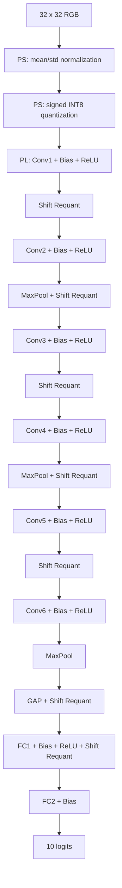

# Model 2 — CIFAR-10 Inference Model

## Overview

Model 2 is a compact VGG-style convolutional neural network used for CIFAR-10 image classification.

The model takes a `32 × 32` RGB image as input and produces 10 output logits corresponding to the CIFAR-10 classes.

The network consists of:

- 6 convolution layers
- ReLU activation after each convolution layer
- 3 max-pooling layers
- Global Average Pooling (GAP)
- 2 fully connected layers

All convolution layers use:

```text
Kernel size : 3 × 3
Stride      : 1
Padding     : 1
```

Therefore, each convolution preserves the spatial resolution of its input feature map.

Spatial downsampling is performed only by the `2 × 2` max-pooling layers.

---

## Model Architecture


The network structure is:

```text
Input RGB Image
3 × 32 × 32
      │
      ▼
Input Normalization
      │
      ▼
Conv1: 3 → 32, 3×3
ReLU
      │
      ▼
32 × 32 × 32
      │
      ▼
Conv2: 32 → 32, 3×3
ReLU
      │
      ▼
MaxPool 2×2
      │
      ▼
32 × 16 × 16
      │
      ▼
Conv3: 32 → 64, 3×3
ReLU
      │
      ▼
64 × 16 × 16
      │
      ▼
Conv4: 64 → 64, 3×3
ReLU
      │
      ▼
MaxPool 2×2
      │
      ▼
64 × 8 × 8
      │
      ▼
Conv5: 64 → 96, 3×3
ReLU
      │
      ▼
96 × 8 × 8
      │
      ▼
Conv6: 96 → 96, 3×3
ReLU
      │
      ▼
MaxPool 2×2
      │
      ▼
96 × 4 × 4
      │
      ▼
Global Average Pooling
      │
      ▼
96
      │
      ▼
FC1: 96 → 128
ReLU
      │
      ▼
128
      │
      ▼
FC2: 128 → 10
      │
      ▼
10-Class Logits
```

---

## Layer Specification

| Layer | Input | Operation | Output |
|---|---|---|---|
| Input | RGB image | Normalization | `3 × 32 × 32` |
| Conv1 | `3 × 32 × 32` | 3×3 Conv, 3→32, ReLU | `32 × 32 × 32` |
| Conv2 | `32 × 32 × 32` | 3×3 Conv, 32→32, ReLU | `32 × 32 × 32` |
| MaxPool1 | `32 × 32 × 32` | 2×2, stride 2 | `32 × 16 × 16` |
| Conv3 | `32 × 16 × 16` | 3×3 Conv, 32→64, ReLU | `64 × 16 × 16` |
| Conv4 | `64 × 16 × 16` | 3×3 Conv, 64→64, ReLU | `64 × 16 × 16` |
| MaxPool2 | `64 × 16 × 16` | 2×2, stride 2 | `64 × 8 × 8` |
| Conv5 | `64 × 8 × 8` | 3×3 Conv, 64→96, ReLU | `96 × 8 × 8` |
| Conv6 | `96 × 8 × 8` | 3×3 Conv, 96→96, ReLU | `96 × 8 × 8` |
| MaxPool3 | `96 × 8 × 8` | 2×2, stride 2 | `96 × 4 × 4` |
| GAP | `96 × 4 × 4` | Global Average Pooling | `96` |
| FC1 | `96` | Fully Connected, ReLU | `128` |
| FC2 | `128` | Fully Connected | `10` |

---

# Numerical Operations

## 1. Input Preprocessing

The original CIFAR-10 input consists of unsigned 8-bit RGB pixels:

```text
R, G, B ∈ [0, 255]
```

The input is first converted to floating point and scaled to `[0, 1]`:

```text
x = pixel / 255
```

Channel-wise normalization is then applied:

```text
x_norm = (x - mean) / std
```

using:

```text
mean = (0.4914, 0.4822, 0.4465)
std  = (0.2470, 0.2435, 0.2616)
```

Therefore, the raw `0–255` RGB values are not directly used as Conv1 operands.

Before Conv1, the normalized activation is quantized to signed INT8.

---

## 2. Convolution

For an output channel `o` at spatial position `(h, w)`, a convolution computes:

```text
y[o,h,w]
    =
    Σ x[c,h+i,w+j] × W[o,c,i,j]
    + b[o]
```

where the summation is performed over:

```text
c = input channels
i = 0, 1, 2
j = 0, 1, 2
```

because all convolution kernels are `3 × 3`.

The number of multiply-accumulate terms for one output element is therefore:

```text
K = Cin × 3 × 3
  = 9 × Cin
```

For example:

```text
Conv1: K = 3  × 9 = 27
Conv2: K = 32 × 9 = 288
Conv4: K = 64 × 9 = 576
Conv6: K = 96 × 9 = 864
```

---

## 3. INT8 Convolution

The reference inference model uses quantized activations and quantized weights for the convolution operation.

For an activation tensor `x`, an activation scale `s_x` is first determined and the activation is quantized:

```text
x_q = floor(x / s_x)
```

followed by clipping to the signed INT8 range:

```text
x_q ∈ [-128, 127]
```

Each convolution layer also has an INT8 weight tensor `w_q` and a corresponding weight scale `s_w`.

The integer convolution computes:

```text
p = Σ x_q × w_q
```

where `p` is a wide integer accumulation result.

The corresponding floating-point convolution result is reconstructed as:

```text
y = p × s_x × s_w + bias
```

Thus, the integer MAC result and its numerical interpretation are related by:

```text
Integer MAC
    p = Σ x_q × w_q

Real-domain result
    y = p × (s_x × s_w) + b
```

---

## 4. ReLU

ReLU is applied after every convolution layer and after FC1.

The operation is:

```text
ReLU(x) = max(0, x)
```

Therefore:

```text
x < 0  →  0
x ≥ 0  →  x
```

ReLU removes negative activations and introduces non-linearity into the network.

---

## 5. Max Pooling

Each max-pooling layer uses:

```text
Kernel size : 2 × 2
Stride      : 2
```

For each channel, the maximum value in every `2 × 2` region is selected:

```text
y[c,h,w]
    =
    max(
        x[c,2h,  2w],
        x[c,2h+1,2w],
        x[c,2h,  2w+1],
        x[c,2h+1,2w+1]
    )
```

Max pooling reduces the spatial dimensions by a factor of two:

```text
32 × 32 → 16 × 16
16 × 16 →  8 × 8
 8 ×  8 →  4 × 4
```

while preserving the number of channels.

---

## 6. Global Average Pooling

After Conv6 and the final max-pooling layer, the feature-map shape is:

```text
96 × 4 × 4
```

Global Average Pooling computes one value for each channel by averaging all 16 spatial values:

```text
GAP[c]
    =
    (1 / 16)
    × Σ x[c,h,w]
```

where:

```text
h = 0 ... 3
w = 0 ... 3
```

The resulting tensor is therefore reduced from:

```text
96 × 4 × 4
```

to:

```text
96
```

and is used as the input to FC1.

---

## 7. Fully Connected Layers

FC1 performs:

```text
y = Wx + b
```

with:

```text
Input  : 96
Output : 128
```

followed by ReLU.

FC2 performs:

```text
Input  : 128
Output : 10
```

and produces the final CIFAR-10 logits.

The predicted class is:

```text
prediction = argmax(logit)
```

---

# Activation Requantization

## Why Requantization Is Required

The output of a quantized convolution is not directly an INT8 activation.

The convolution performs:

```text
INT8 activation
      ×
INT8 weight
      ↓
Wide integer accumulation
```

and therefore produces a value with a much larger numerical range than `[-128, 127]`.

Before that activation is used by the next convolution or fully connected layer, it must be converted back into an INT8 representation.

This operation is referred to as **requantization**.

Requantization is different from the initial RGB preprocessing:

```text
Initial preprocessing:
raw RGB → normalized model input

Requantization:
intermediate layer output → INT8 input for next weighted layer
```

---

## Reference Requantization Method

In the current inference reference, the quantization scale of an activation tensor is determined from its maximum absolute value.

For an activation tensor `x`:

```text
max_abs = max(|x|)
```

and the INT8 scale is:

```text
s_x = 2 × max_abs / 255
```

The activation is then quantized as:

```text
x_q = floor(x / s_x)
```

and clipped to:

```text
[-128, 127]
```

After ReLU, all values are non-negative, so the effective quantized range becomes:

```text
[0, 127]
```

For example, if the maximum ReLU activation is `Amax`, the scale becomes:

```text
scale = 2 × Amax / 255
```

and the largest activation is mapped approximately to:

```text
Amax / scale
≈ 127.5
```

which is clipped to:

```text
127
```

This allows the available INT8 range to be adapted to the activation range of each intermediate tensor.

---

## Position of Requantization

Requantization occurs before an activation is consumed by the next weighted layer.

The effective sequence of the model is:

```text
Input
 ↓
Normalize
 ↓
Quantize
 ↓
Conv1
 ↓
ReLU
 ↓
Requantize
 ↓
Conv2
```

For a block containing max pooling:

```text
Conv2
 ↓
ReLU
 ↓
MaxPool
 ↓
Requantize
 ↓
Conv3
```

Likewise:

```text
Conv4
 ↓
ReLU
 ↓
MaxPool
 ↓
Requantize
 ↓
Conv5
```

The final convolution block is:

```text
Conv6
 ↓
ReLU
 ↓
MaxPool
 ↓
GAP
 ↓
Requantize
 ↓
FC1
```

and the final hidden fully connected layer is:

```text
FC1
 ↓
ReLU
 ↓
Requantize
 ↓
FC2
```

FC2 is the final weighted layer and therefore does not require another activation requantization.

---

## Summary of Numerical Flow

The inference model can be summarized as:

```text
Raw RGB Image
      ↓
Normalize
      ↓
INT8 Quantization
      ↓

┌─────────────────────────────┐
│ INT8 Weighted Layer         │
│ Conv or FC                  │
│                             │
│ INT8 × INT8                 │
│      ↓                      │
│ Wide Accumulation           │
│      ↓                      │
│ Scale Restoration + Bias    │
│      ↓                      │
│ ReLU / Pool / GAP           │
│      ↓                      │
│ Requantization to INT8      │
└─────────────────────────────┘
      ↓
Next Weighted Layer
      ↓
...
      ↓
10 Output Logits
```

The model therefore maintains low-precision operands for its weighted operations while using a wider numerical representation for intermediate accumulation.


---

# V2 Hardware-Oriented Numerical Mapping

The model definition above is unchanged for V2. The V2 architecture changes
**where** the operations are executed and replaces selected scaling operations
with hardware-friendly integer operations.

The final V2 HW/SW split is:

| Operation | V2 Location |
|---|---|
| RGB input acquisition | PS |
| CIFAR-10 mean/std normalization | PS |
| Initial INT8 input quantization | PS |
| Convolution / matrix multiplication | PL |
| Bias addition | PL |
| ReLU | PL |
| Shift-based requantization | PL |
| 2 × 2 maxpool | PL |
| GAP | PL |
| FC1 / FC2 | PL |
| Final logits | PL → PS |

The simplified normalization experiment was rejected because its accuracy fell
to 10.9%. V2 therefore preserves the original trained-model normalization on
the PS.

---

## V2 Input Quantization

After the original channel-wise normalization, the current V2 host flow uses
one signed-symmetric scale over the complete normalized RGB tensor.

```text
Normalized input tensor : 3 × 32 × 32 = 3072 values

max_abs = max(abs(x_norm))
input_scale = max_abs / 127
q_input = round_to_even(x_norm / input_scale)
q_input = clip(q_input, -128, 127)
```

Thus, the PL receives 3072 signed INT8 values rather than raw unsigned RGB
pixels.

The corresponding activation-scale metadata is also retained by the V2
numerical flow because it is required for correct bias-domain conversion.

---

## V2 Weighted-Layer Arithmetic

For every convolution or fully connected layer, the integer datapath can be
viewed as:

```text
INT8 activation
      ×
INT8 weight
      ↓
Wide integer accumulation
      ↓
Activation-scale-dependent bias addition
      ↓
ReLU, if enabled
      ↓
Pooling / GAP, if enabled
      ↓
Layer-wide shift-based requantization
      ↓
INT8 activation for the next weighted layer
```

The physical MAC datapath remains based on the 9 × 16 weight-stationary
systolic array. V2 adds the post-processing and scale/bias handling required to
keep the intermediate activation inside the PL.

---

## Layer-Wide Shift-Based Requantization

The original reference uses an arbitrary activation scale derived from the
activation range. V2 approximates the next activation scale with a power of two
so that the conversion can be implemented using a right shift and rounding.

The conceptual operation is:

```text
q = round(x / 2^n)
```

where `n` is the requantization shift selected from the maximum activation
magnitude of the current layer output.

For non-negative ReLU output, the hardware-friendly rounding operation is
conceptually:

```text
shifted = x >> n

if n > 0 and bit[n-1] == 1:
    shifted = shifted + 1

q = saturate_to_INT8(shifted)
```

The maximum is accumulated across the complete layer output, including all
output-channel tiles. Therefore, V2 uses **one requantization shift per layer
output tensor**, not an independent shift for each output channel.

The shift-based scheme produced:

```text
915 / 1000 = 91.5%
```

compared with 91.9% for the original reference arithmetic, so it was accepted
for V2.

---

## V2 Max Pooling

The mathematical max-pooling operation is unchanged:

```text
maxpool(a, b, c, d) = max(a, b, c, d)
```

V2 performs the reduction while the intermediate feature remains inside the PL.
The controller/post-processing path consumes the four values belonging to one
2 × 2 pooling window and produces one valid pooled output.

This reduces the spatial dimensions as before:

```text
32 × 32 -> 16 × 16
16 × 16 ->  8 × 8
 8 ×  8 ->  4 × 4
```

---

## V2 Global Average Pooling

After the final max-pooling stage, each channel contains a 4 × 4 feature map.
Therefore, the mathematically correct GAP operation reduces **16 values per
channel**:

```text
sum16 = x0 + x1 + ... + x15
GAP   = round(sum16 / 16)
```

Since `16 = 2^4`, the V2 hardware-friendly implementation can use a four-bit
right shift with rounding:

```text
gap = (sum16 >> 4) + rounding_bit
```

where the rounding decision is derived from the highest discarded bit (`bit 3`)
of the positive summed value.

GAP itself does not introduce a new learned scale. The resulting activation is
then requantized for FC1 using the same layer-scale tracking policy.

---

## V2 Bias Representation

Bias must be represented in the integer accumulator domain. Conceptually:

```text
bias_acc = round(bias_real / (activation_scale * weight_scale))
```

The weight scale is fixed for a trained layer, but the activation scale is
dynamic. Therefore, simply preloading one fixed integer bias and attempting to
reuse it for every input does not reproduce the reference arithmetic.

Two approaches were evaluated:

| Bias method | Accuracy | Decision |
|---|---:|---|
| Initial INT32 bias preload + runtime rescaling | 10.3% | Reject |
| PS prepares activation-scale-dependent Q32 bias per image | 91.5% | Accept |

The accepted V2 flow therefore sends the scaled bias parameters needed by the
eight weighted layers. The total number of bias values is:

```text
Conv1 :  32
Conv2 :  32
Conv3 :  64
Conv4 :  64
Conv5 :  96
Conv6 :  96
FC1   : 128
FC2   :  10
----------------
Total : 522
```

These 522 values explain the additional per-image parameter traffic in the
final V2 workflow.

---

# Layer Tensor Footprints

For communication and buffering analysis, each tensor can also be represented
by its flattened element count.

| Layer | Input Elements | Output Elements |
|---|---:|---:|
| Input normalization | — | 3,072 |
| Conv1 | 3,072 | 32,768 |
| Conv2 | 32,768 | 32,768 |
| MaxPool1 | 32,768 | 8,192 |
| Conv3 | 8,192 | 16,384 |
| Conv4 | 16,384 | 16,384 |
| MaxPool2 | 16,384 | 4,096 |
| Conv5 | 4,096 | 6,144 |
| Conv6 | 6,144 | 6,144 |
| MaxPool3 | 6,144 | 1,536 |
| GAP | 1,536 | 96 |
| FC1 | 96 | 128 |
| FC2 | 128 | 10 |

Summing the numerical inputs of Conv1 through FC2 gives:

```text
Total weighted / intermediate layer input elements = 127,712
```

and summing all outputs shown in the table, including the normalized input
tensor, gives:

```text
Total listed output elements = 127,722
```

These totals are descriptive model-footprint values. They should not be confused
with the actual AXI transaction count because the V1 im2col representation
replicates activation values and therefore causes substantially more PS→PL data
movement than the raw tensor sizes alone imply.

---

# V2 End-to-End Numerical Flow



This is the numerical model used by the V2 end-to-end PL engine after the PS
has completed the original input preprocessing.
